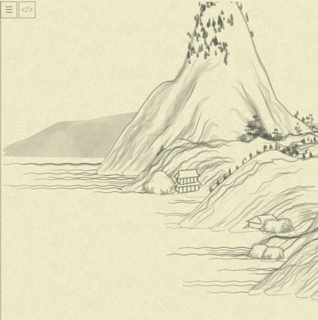
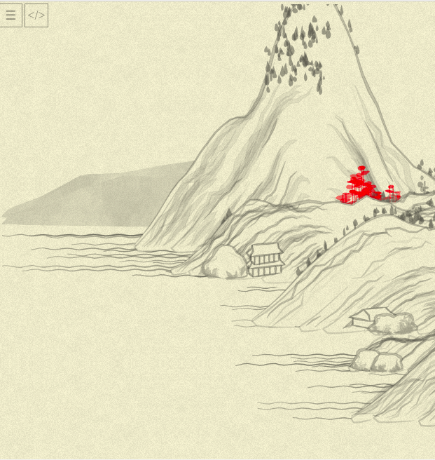

# Day 02: Overview and starting to change the code

The entirety of the project's code is in [one file](https://github.com/LingDong-/shan-shui-inf/blob/master/index.html), spanning some 4k lines, mostly of JS. That might seem esotheric by today's standards, but actually turns out to be convenient for keeping all the context in front of the eyes when "grokking" the project (and, I imagine, provides the same convenience when created it).

The quick overlook of the code allows to understand that:
* it is in pretty old-school vanilla JS
* the organization is very neat and simple: just a bunch of "classes/modules" like [`Tree`](https://github.com/LingDong-/shan-shui-inf/blob/master/index.html#L743), [`Mount`](https://github.com/LingDong-/shan-shui-inf/blob/master/index.html#L1727)(ain), [`Man`](https://github.com/LingDong-/shan-shui-inf/blob/master/index.html#L3324) and so on, with functions like `tree01`, `tree02` etc inside. Plus, there are a bunch of utilities at the beginning of the file (for drawing and random data generation), and some harness to put it all together closer to the end.

So, let's just start from the middle, the most "interesting" part: like, how some particular object on the image is drawn. We'll look into everything else on per-necessity basis, on the road.

Here we go with some tree:

```js
this.tree01 = function(x, y, args) {
  var args = args != undefined ? args : {};
  var hei = args.hei != undefined ? args.hei : 50;
  var wid = args.wid != undefined ? args.wid : 3;
  var col = args.col != undefined ? args.col : "rgba(100,100,100,0.5)";
  var noi = args.noi != undefined ? args.noi : 0.5;

  reso = 10;
  var nslist = [];
  for (var i = 0; i < reso; i++) {
    nslist.push([Noise.noise(i * 0.5), Noise.noise(i * 0.5, 0.5)]);
  }

  var leafcol;
  if (col.includes("rgba(")) {
    leafcol = col
      .replace("rgba(", "")
      .replace(")", "")
      .split(",");
  } else {
    leafcol = ["100", "100", "100", "0.5"];
  }
  var canv = "";
  var line1 = [];
  var line2 = [];
  for (var i = 0; i < reso; i++) {
    var nx = x;
    var ny = y - (i * hei) / reso;
    if (i >= reso / 4) {
      for (var j = 0; j < (reso - i) / 5; j++) {
        canv += blob(
          nx + (Math.random() - 0.5) * wid * 1.2 * (reso - i),
          ny + (Math.random() - 0.5) * wid,
          {
            len: Math.random() * 20 * (reso - i) * 0.2 + 10,
            wid: Math.random() * 6 + 3,
            ang: ((Math.random() - 0.5) * Math.PI) / 6,
            col:
              "rgba(" +
              leafcol[0] +
              "," +
              leafcol[1] +
              "," +
              leafcol[2] +
              "," +
              (Math.random() * 0.2 + parseFloat(leafcol[3])).toFixed(1) +
              ")",
          },
        );
      }
    }
    line1.push([nx + (nslist[i][0] - 0.5) * wid - wid / 2, ny]);
    line2.push([nx + (nslist[i][1] - 0.5) * wid + wid / 2, ny]);
  }
  canv +=
    poly(line1, { fil: "none", str: col, wid: 1.5 }) +
    poly(line2, { fil: "none", str: col, wid: 1.5 });
  return canv;
};
```

Before we start any attempt to refactor it, note that tree color is passed through parameters (it is invoked from [here](https://github.com/LingDong-/shan-shui-inf/blob/master/index.html#L1924)), but what if we'll change the color of the tree, so they would stand out of the image and we'll see what we are changing?

Though... Even before that, let's stop our image from being random for now, let's just change a
```js
SEED = "" + new Date().getTime();
```
to a constant, shall we?
```diff
-  SEED = "" + new Date().getTime();
+  // SEED = "" + new Date().getTime();
+  SEED = 10000000;
```

This way, we can always look at the same part of the screen, at the same tree, expecting it to change (or, preferrably, not!) after refactoring. Here is the picture with a fixed SEED:


Now, to tree color:
```diff
       var col = args.col != undefined ? args.col : "rgba(100,100,100,0.5)";
+      col = "rgba(255,0,0,0.5)";
```
It worked!



We have a bunch of nice red trees to debug now. Good.

Next, just mechanical changes to more "modern" JS, like change function header to destructuring:
```diff
-    this.tree01 = function(x, y, args) {
-      var args = args != undefined ? args : {};
-      var hei = args.hei != undefined ? args.hei : 50;
-      var wid = args.wid != undefined ? args.wid : 3;
-      var col = args.col != undefined ? args.col : "rgba(100,100,100,0.5)";
-      var noi = args.noi != undefined ? args.noi : 0.5;
+    this.tree01 = function(x, y, { hei = 50, wid = 3, col = "rgba(100,100,100,0.5)", noi = 0.5 }) {
+      col = "rgba(255,0,0,0.5)";
```

Next, I wanted to convert old-school C-like cycles like this:
```js
var nslist = [];
for (var i = 0; i < reso; i++) {
  nslist.push([Noise.noise(i * 0.5), Noise.noise(i * 0.5, 0.5)]);
}
```
To something functional and exposing intention: "10 times, produce this value". In Ruby, I'd write it like this:
```ruby
nslist = reso.times.map { |i| [Noise.noise(i * 0.5), Noise.noise(i * 0.5, 0.5)] }
```

In JS (which, I should aknowledge, I am not really proficient with! especially the modern variety!) that's what I achievent eventually:
```js
function times(n, fun) {
  return Array.from({length: n}, (_, i) => fun(i));
}
// and then...
var nslist = times(reso, i => [Noise.noise(i * 0.5), Noise.noise(i * 0.5, 0.5)]);
```

Not bad!

Next, we might notice the large cycle filling `line1`, and `line2`, and also drawing some on canvas.

I want to separate concerns, and extract every variable generation logic in a self-contained and highly visible statement. We might notice that `line1` and `line2` are produced independently of canvas and of each other. Each of them is depending only on `nx`, `ny`, and the `nslist` generated earlier.

That's how I expressed it, eventually:
```js
var nxs = times(reso, i => x);
var nys = times(reso, i => y - (i * hei) / reso);

var line1 = nxs.zip(nys, nslist).map(
  ([nx, ny, [ns, _]]) => [nx + (ns - 0.5) * wid - wid / 2, ny]
);

var line2 = nxs.zip(nys, nslist).map(
  ([nx, ny, [_, ns]]) => [nx + (ns - 0.5) * wid + wid / 2, ny]
);
```

A few things to notice:
* `nxs` are actually redundant, just repeating the `x` (of the tree position)—I assume it is done for uniformity with other trees' code, will see later;
* `nslist` is actually a list of pairs of _independent_ noises (first value is for `line1`, second is for `line2`), unpack?
* `Array.prototype.zip` is not in JS (why?..) so I handcrafted it myself:
```js
// [1, 2, 3].zip([4, 5, 6], [7, 8, 9]) => [[1, 4, 7], [2, 5, 8], [3, 6, 9]]
Array.prototype.zip = function(...others) {
  return this.map((el, i) => [el, ...others.map(o => o[i])]);
}
```

At this point, the picture is still the same... And I am sleepy.

The end of day 2!
