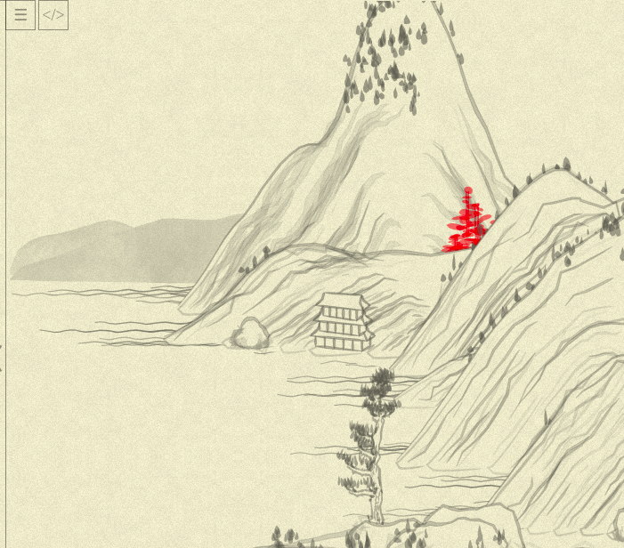
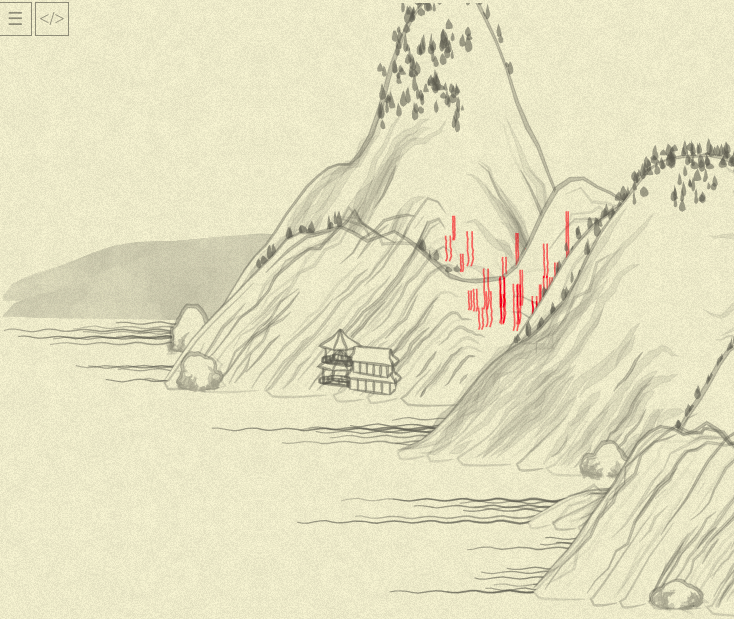

# Day 03: Fighting the tree

We are still on a task of understanding/rewriting `tree01` function!

At this point, it is more or less obvious that `line1` and `line2` are producing tree trunk picture, and the remaining huge `for`, adding some `blob`s to `canv`, is responsible for the crown. Before I fight the `for`, what makes me icky is this way of constructing the colors:

```js
col = "rgba(255,0,0,0.5)";
// ...
var leafcol = col.replace("rgba(", "").replace(")", "").split(",");
//...
{
col:
  "rgba(" +
  leafcol[0] +
  "," +
  leafcol[1] +
  "," +
  leafcol[2] +
  "," +
  (Math.random() * 0.2 + parseFloat(leafcol[3])).toFixed(1) +
  ")",
```

Can we make it a bit less awkward?..

We can!

```js
// prepare the helpers:
class RGBA {
  constructor(r, g, b, a) {
    this.r = r
    this.g = g
    this.b = b
    this.a = a
  }

  toString() {
    return `rgba(${this.r.toFixed()},${this.g.toFixed()},${this.b.toFixed()},${this.a.toFixed(1)})`
  }

  merge({r, g, b, a}) {
    return new RGBA(r || this.r, g || this.g, b || this.b, a || this.a)
  }
}

// just a shortcut for it to look more natural...
function rgba(r, g, b, a) { return new RGBA(r, g, b, a) }

// usage in method's code:
// initial color:
col = rgba(255, 0, 0, 0.5);

// in crown-generating blob:
col: col.merge(Math.random() * 0.2 + col.a).toString()
```

That's better.

Now, for the big cycle:
* the real crown generation starts only when `i >= reso / 4` (so, I suppose, we leave some of the trunk bare)
* ...and then, on each iteration, goes through internal loop `0..(reso - i) / 5`
* ...so, with current `reso` (we'll dig into what it actually is a bit later) being 10, then, for 4, we are going 0..1 (two iterations), at 5, again, 0..1 (two iterations), and then just 1 iteration (the crown becomes thinner to the top!)

Looking at this for some time, I came at the following:
```js
var canv =
  range(reso).zip(nxs, nys).slice(reso / 4).map(
    ([i, nx, ny]) => {
      point = reso - i
      return range(point / 5).map(() => blob(
        nx + (Math.random() - 0.5) * wid * 1.2 * point,
        ny + (Math.random() - 0.5) * wid,
        {
          len: Math.random() * 20 * point * 0.2 + 10,
          wid: Math.random() * 6 + 3,
          ang: ((Math.random() - 0.5) * Math.PI) / 6,
          col: col.merge(Math.random() * 0.2 + col.a).toString(),
        },
      )).join()
    }
  ).join()
```

`map` to produce data in cycle, one additional `range` function (`range(10)` just produces numbers from 0 to 9; more atomic than yesterday's `times`)...

Everything seems more or less reasonable (to me!). But, refreshing the page, I was suddenly stuck with "something is odd here" feeling...



...and comparing it to yesterday's picture, I saw that _everything_ is odd and out of place, even so slightly!


\*Sigh\*.

At first, I even thought I missed some additional place when randomness generator was seeded by today's date. But no, just replacing my "new" cycle back with old one, I got to the old picture back. Weird! How could I break the entire picture with just one cycle, however mistyped? Then I tried to comment out _both_ cycles, and ...



...the landscape is different again! You might notice also that the cycle removal indeed removed the crones, but also a lot of other stuff changed slightly... In seemingly **random** way.

Oh, now I got it.

The "pseudo-randomness" of our random means, that each next call to `Math.random()` depends on how many times it was called before; so, if I'll port the cycle precisely, the rest of the landscape wouldn't be affected. That's the valuable lesson, helping to debug how it is going: if at some point mountains start to shift, I screwed up some of the tree algos!

A bit of `console.log`-debugging... Oh, it should be just `.slice(reso / 4 + 1)` in my new cycle, we are back to the original picture (trust me on this, I'll feel dumb posting pictures of "nothing changed" ever time).

Now, my eyes are harting with this `Math.random()` instances... Can we do this, instead?..

```js
var canv =
  range(reso).zip(nxs, nys).slice(reso / 4 + 1).map(
    ([i, nx, ny]) => {
      point = reso - i
      return range(point / 5).map(() => blob(
        nx + rand(-0.5, 0.5) * wid * 1.2 * point,
        ny + rand(-0.5, 0.5) * wid,
        {
          len: rand(20) * point * 0.2 + 10,
          wid: rand(6) + 3,
          ang: Math.random(-0.5, 0.5) * Math.PI / 6,
          col: col.merge({a: rand(0.2) + col.a}).toString(),
        },
      )).join()
    }
  ).join()
```
It works! The `rand` definition:
```js
// rand(20) -- random number from 0 to 20
// rand(-3, 3) -- random number from -3 to 3
function rand(from, to=undefined) {
  if (to == undefined) {
    to = from;
    from = 0;
  }
  return Math.random() * (to - from) + from
}
```

(Oh, and I also fixed the subtle bug with `col.merge` call, have you noticed?..)

And... Ugh (looks at the time) That's it for today.

So far, I've "functionalized" most of the function (somebody might say I made it worse!), tomorrow I plan to make stuff more informatively named, and somehow wrap up that first tree, making some conclusions from this first element.

For the reference, currently the `tree01` function looks this way:

```js
this.tree01 = function(x, y, { hei = 50, wid = 3, col = "rgba(100,100,100,0.5)", noi = 0.5 }) {
  col = rgba(255, 0, 0, 0.5);

  reso = 10;
  var nslist = times(reso, i => [Noise.noise(i * 0.5), Noise.noise(i * 0.5, 0.5)]);

  var nxs = times(reso, i => x);
  var nys = times(reso, i => y - (i * hei) / reso);

  var line1 = nxs.zip(nys, nslist).map(
    ([nx, ny, [ns, _]]) => [nx + (ns - 0.5) * wid - wid / 2, ny]
  );

  var line2 = nxs.zip(nys, nslist).map(
    ([nx, ny, [_, ns]]) => [nx + (ns - 0.5) * wid + wid / 2, ny]
  );
  var canv =
    range(reso).zip(nxs, nys).slice(reso / 4 + 1).flatMap(
      ([i, nx, ny]) => {
        point = reso - i
        return range(point / 5).map(() => blob(
          nx + rand(-0.5, 0.5) * wid * 1.2 * point,
          ny + rand(-0.5, 0.5) * wid,
          {
            len: rand(20) * point * 0.2 + 10,
            wid: rand(6) + 3,
            ang: rand(-0.5, 0.5) * Math.PI / 6,
            col: col.merge({a: rand(0.2) + col.a}).toString(),
          },
        ))
      }
    ).join()

  canv +=
    poly(line1, { fil: "none", str: col.toString(), wid: 1.5 }) +
    poly(line2, { fil: "none", str: col.toString(), wid: 1.5 });
  return canv;
};
```
