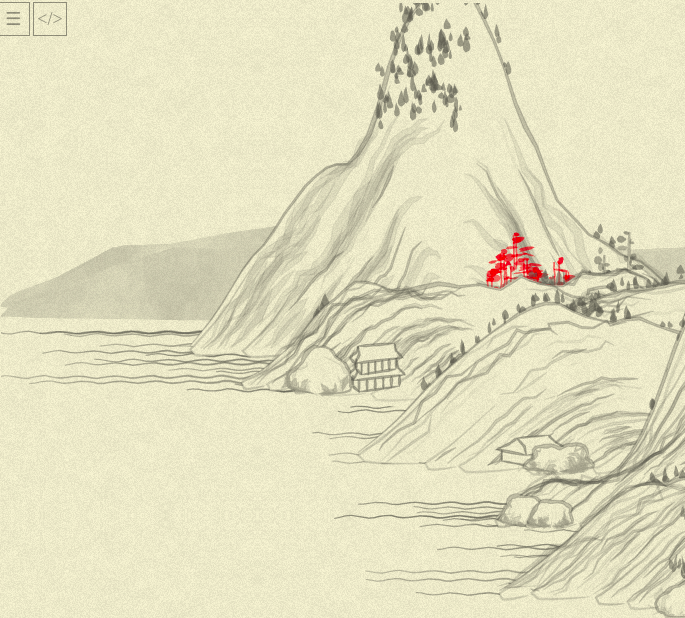

# Day 04: Making sense of the tree

* **Commit:** [e8b1368](https://github.com/zverok/grok-shan-shui/commit/e8b1368a6681998b8f7bdaef543c5764ef0c7beb)
* **Functions:**
  * [`Tree.tree01`](https://github.com/zverok/grok-shan-shui/blob/main/original.html#L744)
  * [`poly`](https://github.com/zverok/grok-shan-shui/blob/main/original.html#L485)
  * [`blob`](https://github.com/zverok/grok-shan-shui/blob/main/original.html#L578)
* **Days about `tree01` function:** [02](day02.md)—[03](day03.md)—**04**—[05](day05.md)

Continuing right from the place where we stopped, I find myself uneasy about the names of things. I still remember loving short names like `ang` in my C++ days, and I still resent prevalent in some codebases multiword over-explanatory names like `angle_for_current_leaf`, but I mostly prefer 1-2 full words for a variable name. It is much easier to read aloud, if nothing else!

So, what about this?

```js
this.tree01 = function(x, y, {height = 50, width = 3, color = rgba(100,100,100,0.5), noise = 0.5 }) {
  color = rgba(255, 0, 0, 0.5);

  resolution = 10;

  var noises = range(resolution).map(i => [Noise.noise(i * 0.5), Noise.noise(i * 0.5, 0.5)]);
  var points = range(resolution).map(i => ({x, y: y - (i * height) / resolution}))

  var line1 = points.zip(noises).map(
    ([point, [noise1, _]]) => [point.x + (noise1 - 0.5) * width - width / 2, point.y]
  );

  var line2 = points.zip(noises).map(
    ([point, [_, noise2]]) => [point.x + (noise2 - 0.5) * width + width / 2, point.y]
  );
  var canvas =
    range(resolution).zip(points).slice(resolution / 4 + 1).flatMap(
      ([i, point]) => {
        to_top = resolution - i
        return range(to_top / 5).map(() => blob_(
          point.x + rand(-0.5, 0.5) * width * 1.2 * to_top,
          point.y + rand(-0.5, 0.5) * width,
          {
            length: rand(20) * to_top * 0.2 + 10,
            width: rand(6) + 3,
            angle: rand(-0.5, 0.5) * Math.PI / 6,
            color: color.merge({a: rand(0.2) + color.a}),
          },
        ))
      }
    ).join()

  canvas +=
    poly_(line1, { fill: "none", stroke: color, width: 1.5 }) +
    poly_(line2, { fill: "none", stroke: color, width: 1.5 });
  return canvas;
};
```

I needed to fix argument names in one place that calls `tree01`, and also the signatures of `blob` and `poly`. As the latter functions are called from everywhere, I just rewrote them into `blob_` and `poly_` with new API (and new code, because why not). `poly_` is self-evident (just generates an SVG polygon):

```js
function poly_(points, {x_offset = 0, y_offset = 0, fill = rgba(0, 0, 0, 0), stroke, width = 0}) {
  stroke ||= fill

  return "<polyline points='" +
    points.map( ([x, y]) => `${(x + x_offset).toFixed(1)},${(y + y_offset).toFixed(1)}` ).join(' ') +
    `' style='fill: ${fill};stroke: ${stroke};stroke-width: ${width}'/>`
}
```

`blob_` is more convoluted, and we'll probably get back to it after handling some of the more high-level stuff:
```js
function blob_(x, y, {
    length = 20,
    width = 5,
    angle = 0,
    color = rgba(200, 200, 200, 0.9),
    noise = 0.5,
    render = true,
    fun}) {

  fun ||= (x) => x <= 1 ? Math.pow(Math.sin(x * Math.PI), 0.5) : -Math.pow(Math.sin((x + 1) * Math.PI), 0.5)

  var resolution = 20.0;
  var las = range(resolution + 1).map( i => {
    var p = (i / resolution) * 2;
    var xo = length / 2 - Math.abs(p - 1) * length;
    var yo = (fun(p) * width) / 2;
    var a = Math.atan2(yo, xo);
    var l = Math.sqrt(xo * xo + yo * yo);
    return [l, a];
  })

  var n0 = Math.random() * 10;
  var noises = range(resolution + 1).
                map( i => Noise.noise(i * 0.05, n0)).
                map( n => n * noise + (1 - noise))

  loopNoise(noises);
  var points = las.zip(noises).map(
    ([[l, a], n]) => [x + Math.cos(a + angle) * l * n, y + Math.sin(a + angle) * l * n]
  )

  if (render) {
    return poly_(points, { fill: color, stroke: color, width: 0 });
  } else {
    return points;
  }
}
```
...but basically it generates some random-ish blob of the specified size.

Now, we might notice that in `noises` array, first values only needed for `line1`, second ones for `line2`; can we just embed it? With not much understanding (yet) of the nature of this `Noise.noise`, I was afraid the different order of calls might change values, but the quick experiment shows that with fixed `SEED`, `Noise.noise(n)` always produces the same value for the same `n`, so... here is the final form of the function:

```js
this.tree01 = function(x, y, {height = 50, width = 3, color = rgba(100,100,100,0.5), noise = 0.5 }) {
  color = rgba(255, 0, 0, 0.5);

  resolution = 10;

  var points = range(resolution).map(i => ({x, y: y - (i * height) / resolution}))

  var trunk1 = points.map(
    (point, i) => [point.x - width / 2 + width * (Noise.noise(i * 0.5) - 0.5), point.y]
  );

  var trunk2 = points.map(
    (point, i) => [point.x + width / 2 + width * (Noise.noise(i * 0.5, 0.5) - 0.5), point.y]
  );
  var crowns =
    range(resolution).zip(points).slice(resolution / 4 + 1).flatMap(
      ([i, point]) => {
        to_top = resolution - i
        return range(to_top / 5).map(() => [
          point.x + rand(-0.5, 0.5) * width * 1.2 * to_top,
          point.y + rand(-0.5, 0.5) * width,
          {
            length: rand(20) * to_top * 0.2 + 10,
            width: rand(6) + 3,
            angle: rand(-0.5, 0.5) * Math.PI / 6,
            color: color.merge({a: rand(0.2) + color.a}),
          },
        ])
      }
    )

  return crowns.map( ([x, y, args]) => blob_(x, y, args)).join() +
         poly_(trunk1, { fill: "none", stroke: color, width: 1.5 }) +
         poly_(trunk2, { fill: "none", stroke: color, width: 1.5 });
};
```

Here is what's going on here, now more or less obvious:
* generate `resolution` number of points with the same `x`, and `y`s spread through all the `height`;
* generate two trunk lines, with each point being shifted by `x` by `width / 2` (left and right), and then "jerked" a bit randomly with noise
* starting from 4th point up, generate crown "blobs" (at lower points, there would be several blobs on top of each other, at higher ones, less and less of them, because we generate `to_top / 5` blobs at each point)
* draw it!

At this point (when I decoupled crown blobs data generation from `blob_` calls), picture changed somewhat:



That's because again of `Math.random()` calls value order (`blob` uses it, too, so "generate random data for one blob → call `blob_`" vs "generate data for all blobs → for every data, call `blob_`" invokes different random numbers). But at this point of the investigation, it seems OK!

And that's the end of Day Four investigation.

Next, with the developed understanding and tools, we'll switch to several other trees, and then to objects with completely different logic!
