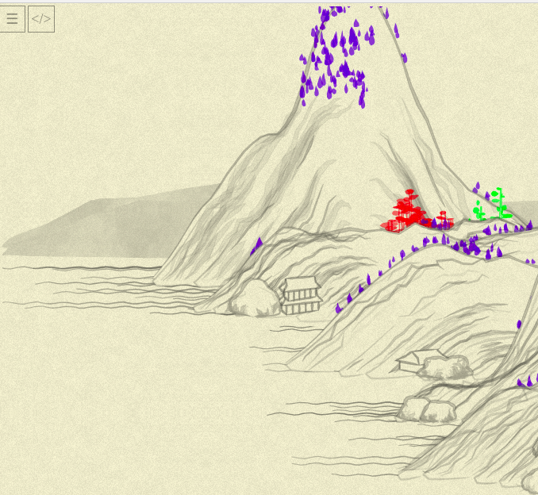
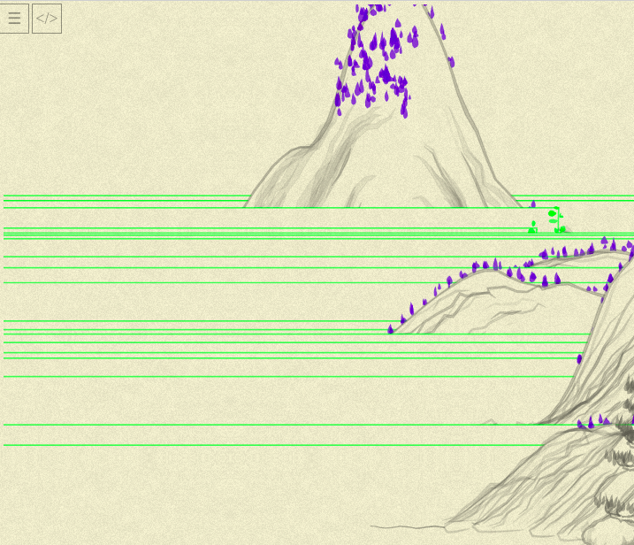
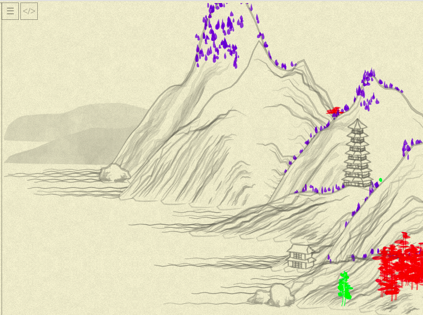

# Day 06: Even moar treees!

* **Commit:** [8000254](https://github.com/zverok/grok-shan-shui/commit/800025415bcb87efe568e1389c44511b00f4f198)
* **Function:** [`Tree.tree03`](https://github.com/zverok/grok-shan-shui/blob/main/original.html#L842)
* **Days about other trees:** [02](day02.md)—[03](day03.md)—[04](day04.md) (tree01), [05](day05.md) (tree02)

Yesterday's investigation have ended somewhat awkwardly: the second tree became rewritten, but to no obvious gain. Let's look at the third one, nevertheless?

First, color it to distinguish (at some point I'll need to return all previous trees to gray, I am almost out of distinguishing colors!)



OK, not a lot of those, but will do.

Again, attempting to handle it all in one go, it doesn't seem _too_ different from the previous ones.

I see some fun stuff on the road!



...and at other point, completely different (and somewhat beautiful) landscape:



(We already know this results of _somebody_ screwing up number of calls to `random()`, e.g. number of blobs to generate, e.g. array slicing.)

Anyways, nothing interesting to report today, here is the final result:

```js
this.tree03 = function(x, y, {height = 50, width = 5, bending = (x)=>0, color = rgba(100,100,100,0.5), noise = 0.5}) {
  color = rgba(0,255,0,0.5);

  resolution = 10;

  var points = range(resolution).map(
    i => ({x: x + bending(i / resolution) * 100, y: y - (i * height) / resolution})
  )
  var line1 = points.map(
    (p, i) => [
      p.x + ((Noise.noise(i * 0.5) - 0.5) * width - width / 2) * (resolution - i) / resolution,
      p.y
    ]
  )
  var line2 = points.map(
    (p, i) => [
      p.x + ((Noise.noise(i * 0.5, 0.5) - 0.5) * width + width / 2) * (resolution - i) / resolution,
      p.y,
    ]
  )

  var shape = (x) => Math.log(50 * x + 1) / 3.95;
  var blobs = range(resolution).zip(points).slice(resolution / 5).flatMap(
    ([i, point]) => range((resolution - i) * 2).map(
      j => {
        var half_length = rand(width * 2) * shape((resolution - i) / resolution);
        return blob_(
          point.x + [-half_length, half_length].sample(),
          point.y + rand(-width, width),
          {
            length: half_length * 2,
            width: rand(6) + 3,
            angle: rand(-0.5, 0.5) * Math.PI / 6,
            color: color.merge({a: rand(0.2) + color.a}),
          },
        );
      }
    )
  )

  return line1.concat(line2.reverse()).
            and_then( line => poly_(line, { fill: "white", stroke: color, width: 1.5 }) ) +
            blobs.join()
};
```
BTW, the call to it passes this bending function:
```js
bc = Math.random() * 0.1
// ...
bending: (x) => Math.pow(x * bc, 1)
```
(Seems that `Math.pow(...)` is no-op here, always having 1 as an exponent—probably the leftover from author's  experimentation. In general, to each `tree01` passed the function that adjusts it a bit, making trees _bent_ in various directions.)

I allowed myself one more "poetic freedom" of Rubyfication of JS:
```js
// [1, 2, 3, 4].sample() => random item from the array
Array.prototype.sample = function() { return this[Math.floor(rand(this.length))] }
```

Other than that, not much insight comes from today's investigation. For all we can say, it just:
* generates two lines with random jerking (drawn together this time, joined at their tops, hence the `concat` + `reverse`) and some bending
* generates small blobs, attached to those lines, more varying in size than for `tree01`, and then shifted of the trunk (note `point.x + [-half_length, half_length].sample()`— randomly shift left or right), to touch it only by corner and produce an effect of another tree species than `tree01`.

I am not much more satisfied than yesterday, leaving behind a few murky points, like, what exactly `shape` does and why it has that particular formula? (I half-suspect I might've recognize it if not for forgetting most of my CS fundamentals). Also I feel like some patterns appearing here aren't fully-exposed, like repetitive `<something> * (resolution - i) / resolution` should maybe have a distinctive name?.. IDK.

Anyhooo... The next tree is much more complicated (probably it is that one huge in the foreground), but tomorrow I want to change an area of digging and look, maybe, at some houses? Just for a change. Because with trees the repeating motive seems to become obvious: make ten points, drew some lines through them, throw some blobs around.

I am reminding myself, the main goal of this investigation is to develop the _intuitions_ on how this stuff is done, and I already have some about the trees!
