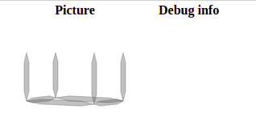
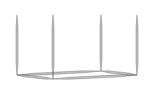
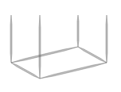
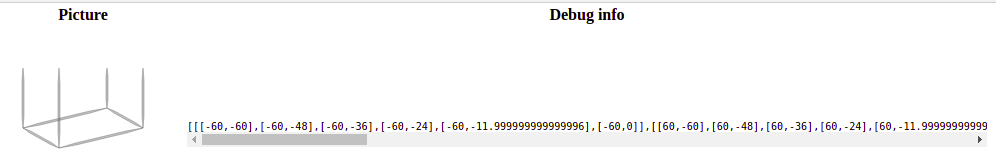
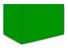

# Day 08: What's in a box?

Yesterday, I finished with getting stuck with `box`es (actually, parallelepipeds?.. ugh, let's stick with "box") the houses consist of. They are mathematically simpler than those blobs making the trees, but amount of simple arithmetic to get lost in is fascinating.

After some head-scratching, I understood I need a separate debug-ground to just drew one box and see what's what. There is no randomness involved _inside_ the `box` and functions it depends upon, so we can just build and experiment freely. That's the time to deep a bit into the "harness" of HTML-with-SVG to copy only the small part of it.

With some copy-pasting of existing functions, and this "document":

```html
<body style="margin:0">
  <table>
    <tr>
      <th>Picture</th>
      <th>Debug info</th>
    </tr>
    <tr id="box">
      <td class="pic"></td>
      <td class="debug"></td>
    </tr>
  </table>
</body>

<script>
  console.log(document.getElementById("box"))
    document.getElementById("box").getElementsByClassName('pic')[0].innerHTML =
      "<svg id='SVG' xmlns='http://www.w3.org/2000/svg' width='200' height='200'><g id='G'>" +
        box_(100, 100, {height: 60}) +
        "</g></svg>";
</script>
```
...we get this beautiful picture:



Whatever, will do. Now we can investigate what's what.

Say, observe how `rotation: 0.3, weight: 1` will affect it:



`bottom: false, transparent: false` seem to affect the drawing exactly according to guessed names (it was `bot` and `tra` in initial code):


(We now have no bottom lines, and the walls are painted white: you can't see the fourth corner now).

Now for more misteryous parameters. What about `per`? It is 4 by default, but what if I change it to 20?..



Oh. `perspective`, probably?.. OK then.

Now, to understand how those various points are produced and what they will contain, I hacked a "debug output" right in the HTML, to not keep looking in the console constantly (and to screenshot stuff more comfortably). I changed `td.debug` to be this:
```html
<td class="debug"><pre style="max-width: 800; overflow-x: scroll; font-size: small;"></pre></td>
```
...and in the `box_` function did an unholy thing (`p` is debug-print function name in Ruby):
```js
var out = document.getElementById('box').getElementsByTagName('pre')[0]
var p = (o) => { out.innerHTML += "\n" + JSON.stringify(o) }
```

...so, now when I do this:
```js
p(ptlist)
```

I have this:


That's something to start with!

Now we can start with the code cleanup itself.

First, the filling (with `transparent: false`), it is easy:

```js
if (!transparent) {
  var corners = [
    [-width/2, -height], // top-left
    [width/2, -height],  // top-right
    [width/2, 0],        // bottom-right
    [mid, perspective],  // front corner
    [-width/2, 0],       // bottom-left
  ];

  canv += poly_(corners, {x_offset, y_offset, stroke: "none", fill: "white"});
}
```
(I changed fill-color to green for visibility):



(We see now that the whole object geometry is not exactly parallelepiped (oh god), but is more simple.)

That's done, now let's make it transparent again and see why so much code is necessary to produce those 8 simple lines (bottom square and 4 posts)?..

The first culprit is `div` function:
```js
function div(plist, reso) {
  var tl = (plist.length - 1) * reso;
  var lx = 0;
  var ly = 0;
  var rlist = [];

  for (var i = 0; i < tl; i += 1) {
    var lastp = plist[Math.floor(i / reso)];
    var nextp = plist[Math.ceil(i / reso)];
    var p = (i % reso) / reso;
    var nx = lastp[0] * (1 - p) + nextp[0] * p;
    var ny = lastp[1] * (1 - p) + nextp[1] * p;

    var ang = Math.atan2(ny - ly, nx - lx);

    rlist.push([nx, ny]);
    lx = nx;
    ly = ny;
  }

  if (plist.length > 0) {
    rlist.push(plist[plist.length - 1]);
  }
  return rlist;
}
```

Let's first change it mechanically...

Well, seems it was initially designed more complex, because `ang` is actually never used, and neither are `lx` and `ly`, accordingly.

So...

```js
function div(points, resolution) {
  return range((points.length - 1) * resolution).map( i => {
    var [prev_x, prev_y] = points[Math.floor(i / resolution)];
    var [next_x, next_y] = points[Math.ceil(i / resolution)];
    var p = (i % resolution) / resolution;

    return [
      prev_x * (1 - p) + next_x * p,
      prev_y * (1 - p) + next_y * p
    ]
  }).concat([points.last()])
}
```

So, what does it do? We can insert our `p` debug-statement into the `box_`, where the first one is invoked, and see!

```js
p({
  points: [[-width * 0.5, -height], [-width * 0.5, 0]],
  div: div([[-width * 0.5, -height], [-width * 0.5, 0]], 5)
})
```

...and have this:
```
{
  "points":[[-60,-60],[-60,0]],
  "div":[[-60,-60],[-60,-48],[-60,-36],[-60,-24],[-60,-11.999999999999996],[-60,0]]
}
```

Basically, given list of points and number which it calls `reso`, it produces another list of points such that it has `reso` mid-points between those of the original line, and all of them lied on the same line. In the case of our box, it converts just two points (start and end of the line) into list of five, to then, I suppose, make an artistic `stroke` through them later.

But time's up for today! Tomorrow we'll try to handle the `div`'s name and parameters, and move further through the `box`.
