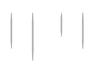

# Day 9: Lines and boxes

* **Commit:** [64562e4](https://github.com/zverok/grok-shan-shui/commit/64562e4c5c938ef6e1f98c2613134e4c338d7d2c)
* **Functions:**
  * [`box`](https://github.com/zverok/grok-shan-shui/blob/main/original.html#L2609)
  * [`div`](https://github.com/zverok/grok-shan-shui/blob/main/original.html#L627)
* **Other days about:**
  * `box`: [07](day07.md)—[08](day08.md)—**09**—[10](day10.md)
  * `div`: [08](day08.md)—**09**

Yesterday, I've uncovered what `div` function does. Thinking a bit more of it, I understood that for _my_ comprehension, operations on sequences are more straightforward way to express things than arithmetic.

I mean, look at the method code again:

```js
function div(points, resolution) {
  return range((points.length - 1) * resolution).map( i => {
    var [prev_x, prev_y] = points[Math.floor(i / resolution)];
    var [next_x, next_y] = points[Math.ceil(i / resolution)];
    var p = (i % resolution) / resolution;

    return [
      prev_x * (1 - p) + next_x * p,
      prev_y * (1 - p) + next_y * p
    ]
  }).concat([points.last()])
}
```

Once I start to reread this "number of resulting points would be `(points.length - 1) * resolution`", and `p` calculations, my head starts to spin. Trying to explain to _myself_ what should be done, I'd rather say, "adds several midpoints between each pair of points". So, why not I say it?

```js
function extrapolate(points, {num_of_midpoints}) {
  return points.eachCons(2).flatMap( ([[x1, y1], [x2, y2]]) =>
    range(num_of_midpoints).map(
      i => [x1 + (x2 - x1) / num_of_midpoints * i, y1 + (y2 - y1) / num_of_midpoints * i]
    )
  ).concat([points.last()])
}
```
`eachCons` is borrowed from Ruby again, meaning "each consecutive sub-sequence (of size 2 in our case)":
```js
// [1, 2, 3, 4, 5].eachCons(2) => [[1, 2], [2, 3], [3, 4], [5, 6], [7, 8]]
Array.prototype.eachCons = function(size) {
  var others = range(size).map(i => this.slice(i)).slice(1)
  return this.slice(null, this.length - size + 1).zip(...others)
}
```
So: my new function `extrapolate` does: for each pair of points in source sequence, produce `num_of_midpoints` between them, by adding the averages. Testing it in the `box`:
```js
p({
  points: [[-width * 0.5, -height], [-width * 0.5, 0]],
  div: div([[-width * 0.5, -height], [-width * 0.5, 0]], 5),
  extrapolate: extrapolate([[-width * 0.5, -height], [-width * 0.5, 0]], {num_of_midpoints: 5})
})
```
Output:
```

{
  "points":[[-60,-60],[-60,0]],
  "div":        [[-60,-60],[-60,-48],[-60,-36],[-60,-24],[-60,-11.999999999999996],[-60,0]],
  "extrapolate":[[-60,-60],[-60,-48],[-60,-36],[-60,-24],[-60,-12],[-60,0]]}
```

Oh, it works. And actually... I hate to say it, but it works a bit better :) (Notice `12` and `11.(9)`).

> Note: `num_of_midpoints` is a bit over-explanatory name for my usual style, but let's keep it, can't think of something shorter yet clean (`midpoints` would be confusing as the second parameter besides `point`).

Back to the box!

We might notice that `ptlist.push(div([point, other_point], 5));` is repeating many times, and while inserting `extrapolate` there, may as well do it cleaner:

```js
var lines = [];
lines.push([[-width * 0.5, -height], [-width * 0.5, 0]]);

lines.push([[width * 0.5, -height], [width * 0.5, 0]]);
if (bottom) {
  lines.push([[-width * 0.5, 0], [mid, perspective]]);
  lines.push([[width * 0.5, 0], [mid, perspective]]);
}
lines.push([[mid, -height], [mid, perspective]]);
if (transparent) {
  if (bottom) {
    lines.push([[-width * 0.5, 0], [bmid, -perspective]]);
    lines.push([[width * 0.5, 0], [bmid, -perspective]]);
  }
  lines.push([[bmid, -height], [bmid, -perspective]]);
}

lines = lines.map( points => extrapolate(points, {num_of_midpoints: 5}) )
```

Oh, something starts to get clearer... And, a few strokes...

```js
var left = -width/2
var right = +width/2
var top = -height
var bottom = 0

var front_x = left + width * rotation;
var front_y = perspective

var back_x = left + width * (1 - rotation);
var back_y = -perspective

var lines = [];
lines.push([[left, top], [left, bottom]]);

lines.push([[right, top], [right, bottom]]);
if (has_bottom) { // bottom function argument was renamed to not collide with bottom coordinate
  lines.push([[left, bottom], [front_x, front_y]]);
  lines.push([[right, bottom], [front_x, front_y]]);
}
lines.push([[front_x, top], [front_x, front_y]]);
if (transparent) {
  if (has_bottom) {
    lines.push([[left, bottom], [back_x, back_y]]);
    lines.push([[right, bottom], [back_x, back_y]]);
  }
  lines.push([[back_x, top], [back_x, back_y]]);
}

lines = lines.map( points => extrapolate(points, {num_of_midpoints: 5}) )
```

Makes more sense, right?.. Now we can almost see what lines we are doing. Taking it a bit further...

```js
// First, side of the house
var lines = [
  [ [left , top], [left , bottom] ],
  [ [right, top], [right, bottom] ]
]
// background post
if (transparent) { lines.push([ [back_x, top], [back_x, back_y] ]) }

if (has_floor) {
  lines = lines.concat([
    [ [left , bottom], [front_x, front_y] ],
    [ [right, bottom], [front_x, front_y] ]
  ])
  if(transparent) { // two background lines of the floor
    lines = lines.concat([
      [[left , bottom], [back_x, back_y] ],
      [[right, bottom], [back_x, back_y] ]
    ])
  }
}
// foreground post, should come last
lines.push([[front_x, top], [front_x, front_y]])
```

OK, that's probably enough. I lost a floor under my feet for a few seconds, though:



...because weirdly enough, in Ruby `array.concat` is mutating the source array, so it was just `lines.concat(...)` initially, instead of `lines = lines.concat(...)`.

TBH, in Ruby I'd took it a bit further. I like to gather arrays with optional items this way:

```ruby
[
  item1,
  (optional_item2 if condition), # in Ruby, `if` is an expression, and tail `if` is allowed,
                                 # and this line will just produce `nil` if condition is false
  item3,
  (optional_item4 if condition)
].compact # drop `nil`s
```
But alas, in JS I can't do that!

The way it stays now is not feeling completely _declarative_ for me, TBH, like "the picture just _consists_" of those lines... But it is as far as it gets without reinventing the whole language (a lot of people might imagine I've already gone too far).

Finally, the method's final loop also gets some mechanical cleanup:
```js
// before
for (var i = 0; i < lines.length; i++) {
  canv += stroke(
    lines[i].map(([x, y]) => [x + x_offset, y + y_offset]),
    {
      col: color.toString(),
      noi: 1,
      wid: weight,
      fun: (x) => 1
    },
  );
}

// after
canv += lines.map( line =>
  stroke(
    line.map(([x, y]) => [x + x_offset, y + y_offset]),
    {
      col: color.toString(),
      noi: 1,
      wid: weight,
      fun: (x) => 1
    },
  )
).join()
```

...but that shouldn't be a surprise for an attentive reader.

For the reference, here's the whole `box_`'s code as of now:
```js
var box_ = function(x_offset, y_offset,
  {
    height = 20, width = 120, rotation = 0.7, perspective = 4,
    transparent = true, has_floor = true, weight = 3, dec = (a) => [],
    color = rgba(100,100,100,0.4)
  }
) {
  var out = document.getElementById('box').getElementsByTagName('pre')[0]
  var p = (o) => { out.innerHTML += "\n" + JSON.stringify(o) }

  var left = -width/2
  var right = +width/2
  var top = -height
  var bottom = 0

  var front_x = left + width * rotation;
  var front_y = perspective

  var back_x = left + width * (1 - rotation);
  var back_y = -perspective

  // First, side of the house
  var lines = [
    [ [left , top], [left , bottom] ],
    [ [right, top], [right, bottom] ]
  ]
  // background post
  if (transparent) { lines.push([ [back_x, top], [back_x, back_y] ]) }

  if (has_floor) {
    lines = lines.concat([
      [ [left , bottom], [front_x, front_y] ],
      [ [right, bottom], [front_x, front_y] ]
    ])
    if(transparent) { // two background lines of the floor
      lines = lines.concat([
        [[left , bottom], [back_x, back_y] ],
        [[right, bottom], [back_x, back_y] ]
      ])
    }
  }
  // foreground post, should come last
  lines.push([[front_x, top], [front_x, front_y]])

  lines = lines.map( points => extrapolate(points, {num_of_midpoints: 5}) )

  var surf = (rotation < 0.5) * 2 - 1;
  lines = lines.concat(
    dec({
      pul: [surf * right, top],
      pur: [front_x, top + perspective],
      pdl: [surf * right, bottom],
      pdr: [front_x, front_y],
    }),
  );

  var canv = "";
  if (!transparent) {
    canv += poly_(
      [
        [left   , top    ],
        [right  , top    ],
        [right  , bottom ],
        [front_x, front_y],
        [left   , bottom ],
      ],
      {x_offset, y_offset, stroke: "none", fill: "white"}
    );
  }

  canv += lines.map( line =>
    stroke(
      line.map(([x, y]) => [x + x_offset, y + y_offset]),
      {
        col: color.toString(),
        noi: 1,
        wid: weight,
        fun: (x) => 1
      },
    )
  ).join()
  return canv;
};
```
...and tomorrow, I plan to finish the investigation with looking into `stroke` and that weird `dec` call (at least with currently named variables I am starting to suspect what `pul`/`pur` names might mean!)
