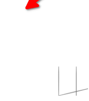
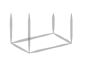
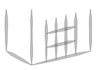
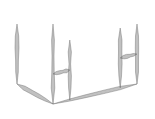
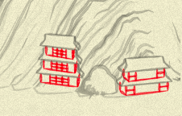
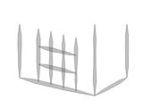
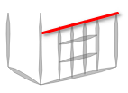

## Day 10: (there is no good pun with the word "stroke")

So, let's continue to dig into the `box_` function—now, to the `stroke` call.

As usual, casually going through "beautiful" pictures during debugging the refactored...



(the arrow shows where the box is supposed to be; but that's nothing of interest, I just noticed the `stroke` has its own `x_offset` and `y_offset` parameters and passed them from `box_`, but forgot to remove their second addition in the `box_` itself)

And here we go:

```js
function stroke_(points,
  {x_offset = 0, y_offset = 0, width = 2, color = rgba(200,200,200,0.9), noise = 0.5, outline = 1,
    shaper = (x) => Math.sin(x * Math.PI)}
) {

  if (points.length == 0) return "";

  var n0 = Math.random() * 10;
  var transitions = points.eachCons(3).map( ([[x_prev, y_prev], [x, y], [x_post, y_post]], idx) => {
    i = idx + 1
    var distance = width * shaper(i / points.length);
    distance = distance * (1 - noise) + distance * noise * Noise.noise(i * 0.5, n0);

    var angle_before = Math.atan2(y - y_prev, x - x_prev)
    var angle_after = Math.atan2(y - y_post, x - x_post)
    var angle = (angle_before + angle_after) / 2;
    if (angle < angle_after) angle += Math.PI;

    return [distance, angle]
  })

  var vertexes_top = transitions.zip(points.slice(1)).map(
    ([[distance, angle], [x, y]]) => [x + distance * Math.cos(angle), y + distance * Math.sin(angle)]
  )

  var vertexes_bottom = transitions.zip(points.slice(1)).map(
    ([[distance, angle], [x, y]]) => [x - distance * Math.cos(angle), y - distance * Math.sin(angle)]
  )

  console.log({transitions, points, vertexes_top, vertexes_bottom})

  return [
    points[0],
    ...vertexes_top,
    points.last(),
    ...vertexes_bottom.reverse(),
    points[0]
  ].
    map(([x, y]) => [x + x_offset, y + y_offset]).
    and_then( vertexes => poly_(vertexes, {fill: color, stroke: color, width: outline}))
}
```
...it should be more or less obvious now: given a line of points `(x, y)`, it calculates two sets of pairs of other dots, being somewhere around the line, but randomly shifted, and then draws a filled polygon with outline to imitate "humane" brush stroke. If we'll increase `box_`'s `weight` parameter, it becomes a bit more visible:



Now, the last mystery of our `box_` call in original house was the `dec` parameter, where that house passed `deco` function (I _adore_) short names. Let's add it to debug script and see.

Our call to `box_` will now look this way (mimicking the code from the `arch02`):
```js
var hsps = [[], [1, 5], [1, 5], [1, 4]]
var vsps = [[], [1, 2], [1, 2], [1, 3]]

var sty = 3

var box = box_(100, 100,
  {
    height: 60,
    rotation: 0.3,
    weight: 3,
    perspective: 20,
    transparent: false,
    dec: (a) => deco(sty, {...a, hsp: hsps[sty], vsp: vsps[sty]})
  })
```
And the result would be this (with `sty=3`)



Here are other possible styles: 1 and 2 (because, looking into `deco` for some time, we can understand that's what `sty` means!)




Style (2) we've seen a lot on our "test house", here are styles 1 and 3 in the same picture I am using as a test one, other side of it:



The call to `dec` parameter (which I'm renaming `decoration`) in `box_` looks this way:
```js
var surf = (rotation < 0.5) * 2 - 1;
lines = lines.concat(
  decoration({
    pul: [surf * width, top],
    pur: [front_x, top + perspective],
    pdl: [surf * width, bottom],
    pdr: [front_x, front_y],
  }),
);
```

Basically, it passes four corners to the provided decoration function, and it can return some additional lines (sets of coordinates), adding, well... "decorations" to the wall!

Now, this (baffling for me! My brain processes arithmetic slower than code) `surf` variable is actually a fancy way to say "we choose either left, or right wall, depending on the rotation": if rotation is `< 0.5`, then `(rotation < 0.5) * 2 - 1` evaluates to `1 * 2 - 1`, e.g. just 1, and `1 * width` would be the rightmost part of what we are drawing, and if the rotation is higher...



...another wall is choosen.

So we can simplify the call to:

```js
var side = (rotation < 0.5) ? right : left;
lines = lines.concat(
  decoration({
    pul: [side   , top],
    pur: [front_x, top + perspective],
    pdl: [side   , bottom],
    pdr: [front_x, front_y],
  }),
);
```

Note also that for `pur` ("point upper right", I guess!) we are passing `top + perspective` so the decoration will know the "proper" coordinate of the front upper corner, unlike the line of the post:



(red line is drawn by me on top of the screenshot).

Now, for the `deco` function, I want to do only a shallow rewrite, so it would have more civilian signature. Inside it, we have a ton of simple "calculate point" arithmetic, but as I am almost at half of my advent, and it is pretty easy to understand nothing non-trivial happens inside, I'll not bother.

The singature will look this way now:

```js
var decorator = function(style,
  {
    up_left = [0, 0], up_right = [0, 100], down_left=[100, 0], down_right=[100, 100],
    horz_spacing = {padding: 1, count: 3}, vert_spacing = {padding: 1, count: 2}
  }
)
```

...and I updated `style` choice to use words instead of numbers, so the call to box with decoration will look this way:

```js
var horz_spacings = {
  t_shapes: {padding: 1, count: 5},
  fence: {padding: 1, count: 5},
  grid: {padding: 1, count: 4}
}
var vert_spacings = {
  t_shapes: {padding: 1, count: 2},
  fence: {padding: 1, count: 2},
  grid: {padding: 1, count: 3}
}

var style = 'grid'

var box = box_(100, 100,
  {
    height: 60,
    rotation: 0.3,
    weight: 3,
    perspective: 20,
    transparent: false,
    decoration: (points) =>
      decorator(style, {...points, horz_spacing: horz_spacings[sty], vert_spacing: vert_spacings[sty]})
  })
```

...and inside `box_`:

```js
var side = (rotation < 0.5) ? right : left;
lines = lines.concat(
  decoration({
    up_left:    [side   , top],
    up_right:   [front_x, top + perspective],
    down_left:  [side   , bottom],
    down_right: [front_x, front_y],
  }),
);
```

Phew! All mysteries of the box are solved! Tomorrow, we'll return to the house itself, which also has `rail` and `roof`. To be completely honest, I don't expect a lot of further insights there: it would be probably more combinations of lines, coordinates and points. But at least one house needs to be finished to say "we are now getting how it is done"!
