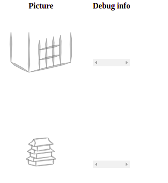
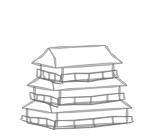
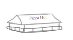

# Day 11: Back to home

* **Commit:** [4bd5721](https://github.com/zverok/grok-shan-shui/commit/4bd5721ab55b11f488d578357c2b947aefdc1d49)
* **Functions:**
  * [`Arch.arch02`](https://github.com/zverok/grok-shan-shui/blob/main/original.html#L3061)
* **Other days about:**
  * `arch02`: [07](day07.md), **11**

Now, when we uncovered the `box`, we can return to the `arch02` as a whole. But after I made myself to have a separate debug file, I'll probably continue there for some time. I add a row to the table of pictures

```html
    <tr id="arch02">
      <td class="pic"></td>
      <td class="debug"><pre style="max-width: 800; overflow-x: scroll;font-size: small;"></pre></td>
    </tr>
```

...and my final JS of the `debug.html` now says this:

```js
var box = box_(100, 100,
  {
    height: 60,
    rotation: 0.3,
    weight: 3,
    perspective: 20,
    transparent: false,
    decoration: (a) =>
      decorator(style, {...a, horz_spacing: horz_spacings[style], vert_spacing: vert_spacings[style]})
  })

var house = arch02(100, 100, 0, {}) // draw at (100, 100) with all the default params

function showSVG(rowId, svg) {
  document.getElementById(rowId).getElementsByClassName('pic')[0].innerHTML =
    "<svg id='SVG' xmlns='http://www.w3.org/2000/svg' width='200' height='200'><g id='G'>" +
      svg + "</g></svg>";
}

showSVG('box', box)
showSVG('arch02', house)
````

...at voila, the entire `debug.html` (after copying to it necessary functions) renders like this:




We are free to experiment with the house; can even try what it would look like if we'll add a `has_rail: true` to it (which the original file never does):



(I increased size to `width: 100, height: 15` for better visibility)
Nice!

The function `archo02` itself looks this way currently, after the previous wave of refactoring:

```js
arch02 = function(xoff, yoff, seed = 0,
  {height = 10, width = 50, rotation = 0.3, per = 5, sto = 3, sty = 1, has_rails = false}
) {
  var hsps = [[], [1, 5], [1, 5], [1, 4]]
  var vsps = [[], [1, 2], [1, 2], [1, 3]]

  return range(sto).map( i => i * height * 1.5 ). // produce series of h_offsets
         map( (hoff, i) => {
           return box_(xoff, yoff - hoff, {
              transparent: false,
              height: height,
              width: width * Math.pow(0.85, i),
              rotation: rotation,
              weight: 1.5,
              per: per,
              dec: (a) => deco(sty, {...a, hsp: hsps[sty], vsp: vsps[sty]})
            }) +
            (has_rails ?
              rail(xoff, yoff - hoff, i * 0.2, {
                wid: width * Math.pow(0.85, i) * 1.1,
                hei: height / 2,
                per: per,
                rot: rotation,
                wei: 0.5,
                tra: false,
              })
            : '') +
            roof(xoff, yoff - hoff - height, {
              hei: height,
              wid: width * Math.pow(0.9, i),
              rot: rotation,
              wei: 1.5,
              per: per,
              pla: (sto == 1 && Math.random() < 1 / 3 ? [1, "Pizza Hut"] : undefined),
            })
         })
}
```

We can incorporate our achievements with redesigning of the `box_`, and also now the parameter names are clearer: `per` is `perspective`, `sty` is `style` and `sto` is number of stories (3 by default)

```js
    arch02 = function(x_offset, y_offset, seed = 0,
      {height = 10, width = 50, rotation = 0.3, perspective = 5, stories = 3, style = 'grid', has_rails = false}
    ) {
      var horz_spacings = {
        t_shapes: {padding: 1, count: 5},
        fence: {padding: 1, count: 5},
        grid: {padding: 1, count: 4}
      }
      var vert_spacings = {
        t_shapes: {padding: 1, count: 2},
        fence: {padding: 1, count: 2},
        grid: {padding: 1, count: 3}
      }

      return range(stories).map( story => story * height * 1.5 ). // produce series of stories offsets
             map( (story_y, story) => {
               return box_(x_offset, y_offset - story_y, {
                  transparent: false,
                  height: height,
                  width: width * 0.85**story,
                  rotation: rotation,
                  weight: 1.5,
                  perspective: perspective,
                  decorator: (wall_corners) =>
                    decoration(style,
                      {...wall_corners, horz_spacing: horz_spacings[style], vert_spacing: vert_spacings[style]})
                }) +
            // ...and so on
```

Two functions I want to introduce now to make the flow more obvious:
```js
// chance(probability, ()=> do this)
var chance = (probability, action) => Math.random() < probability ? action() : undefined

// if_(something, ()=> do this)
var if_ = (condition, action) => condition ? action() : undefined
```

Which makes the bottom part of the function (rail & roof) into this:
```js
  // make walls, then...
  if_(has_rails, ()=>
    rail(x_offset, y_offset - story_y, story * 0.2, {
      wid: width * 0.85**story * 1.1,
      hei: height / 2,
      per: perspective,
      rot: rotation,
      wei: 0.5,
      tra: false,
    })) +
  roof(x_offset, y_offset - story_y - height, {
    hei: height,
    wid: width * 0.9**story,
    rot: rotation,
    wei: 1.5,
    per: perspective,
    pla: if_(stories == 1, ()=> chance(2/3, ()=> [1, "Pizza Hut"])),
  })
```

So, with 1 story building, a good chance is we'll see the Easter egg!



Where do we go from here?

I mean, following the "full rewrite" road it is obvious next I should handle `rail` and `roof` the same way I did to `box`, but I think I'll skip it. Full rewrite for the sake of "have this project written my way" was never my goal, develop understanding of how it is done was, and also, understanding of how can I write code in "definition-first" way instead of "implementation-first".

Looking with this attitude, it is more or less obvious roofs and rails would be "more of the same": calculate some points to make a necessary figure (considering all the rotation/perspective math), do `poly`s and `stroke`s through those point. Even short parameter names (like `per` and `tra`) are the same as we've already seen.

I don't expect some big insights coming from this work, so I leave the houses logic at that—at least, for now.

Instead, I took a couple minutes to think about the whole picture and what I've learned so far.

1. I've got through three different ways of drawing trees, and one way of drawing houses in this picture.
2. All of them aren't that mysterious now: trees are "two strait lines + a bunch of blobs among them", houses just a simple line geometry, just many lines combined.
3. The way to make it look natural/hand-drawn is:
  a) some well-chosen constants;
  b) some randomness in parameters, but inside small ranges;
  c) some Perlin noise (sequence of random values with smooth change between nearby values)
4. I believe it required both a lot of drawing/artistic intuition, and geometry/computer imagery intuition of author to come up with this solution: to deconstruct some drawings in simple forms, and then, gather those forms back into nice random(ish) drawings
5. To represent it all in a "declarative" code I am striving for, one might develop kind of a domain-specific language on top of a target one; this is at the same time obvious and half-formed thought I'll postpone till the end of the investigation.

Till now, I've investigated the stuff from inside out: "how this particular unit of the picture is produced". We still have un-investigated units like boats and people; but tomorrow, I'll want to look on the bigger picture, and try to understand how the high-level decision on landscape composition is made. After that, I'll try to look at the mid-level and investigate the approach of the larger landscape features, like mountains and lakes.

Still quite enthusiastic about the whole endeavor, surprisingly!
