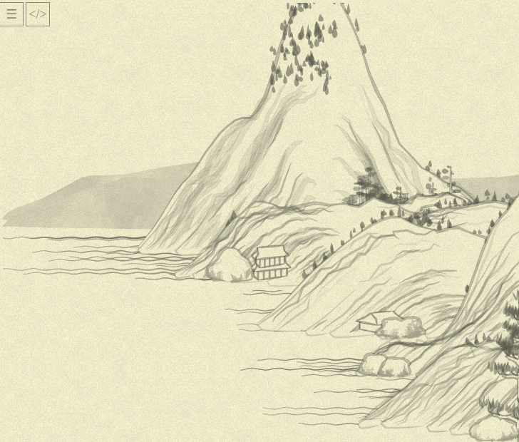
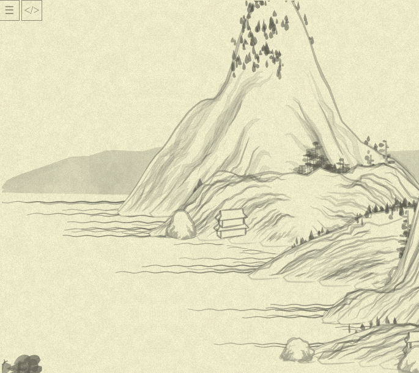
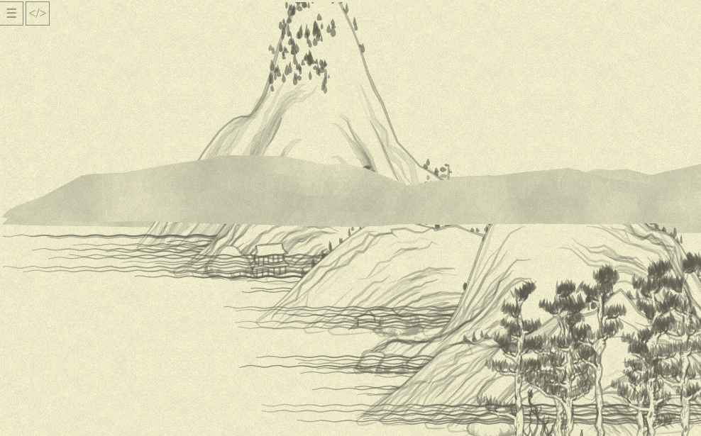

# Day 12: Seeing the forest behind the trees

* **Commit:** [7e4a9a7](https://github.com/zverok/grok-shan-shui/commit/7e4a9a720ab3b55b1afac9f7a30b3a0fdbab69f2)
* **Functions:**
  * [`chunkloader`](https://github.com/zverok/grok-shan-shui/blob/main/original.html#L3845)
* **Other days about:**
  * `chunkloader`: **12**, [21](day21.md)

Yesterday I finished with a thought that the way small items on the picture is defined became clearer now, and a wish to do a next approach top-down.

First, I copied from `debug.html` everything I've achieved so far.

As usual with the big picture, there is quite a bit of struggle to make sure I am not missing anything...

Expected picture:



Actual picture at some point:



The interesting thing to notice here: the decorations on walls of the house in the center of the picture is missing (I'll fix it in short), and it leads to an interesting effect: background stays the same, foreground changes (due to a different sequence of randomness when something is missing in the process). This will be useful to remember when we'll try to understand the bigger picture.

(Oh, I just mistyped `decorator: decoration(...)` yesterday instead of `decoration: decorator` in `box_` call from `arch02` and never noticed it! Weird nothing told me so... But whatever, I guess!)

We are back to the right picture, and can start to investigate from the top.

After some digging into the bottom part of the file, we can say that all magic is invoked in the `update` method, which, in turn, calls the `chunkloader`. Which is the main entry point for the real drawing.

The quick overview of the method allows to see this structure:

```js
while (...) { // some cycle, let's deal with it later
  if (...) {
    plan = mountplanner(MEM.xmax, MEM.xmax + MEM.cwid);
    ...
  } else {
    plan = mountplanner(MEM.xmin - MEM.cwid, MEM.xmin);
    ...
  }

  // ...iterate through the plan...
}
```

This last iteration is of interest, and we can, like...

```js
plan.forEach( ({tag, x, y}, i) => {
  switch(tag) {
    case "mount":
      add({tag, x, y,            canv: Mount.mountain(x, y, rand(i * 2))});
      add({tag, x, y: y - 10000, canv: water(x, y, i * 2)});
      break
  case "flatmount":
    add({tag, x, y,
      canv: Mount.flatMount(x, y, rand(2 * Math.PI), {wid: rand(600, 1000), hei: 100, cho: rand(0.5, 0.7)}),
    });
    break
  case "distmount":
    add({tag, x, y,
         canv: Mount.distMount(x, y, rand(100), {hei: 150, len: randChoice([500, 1000, 1500])})});
    break
  case "boat":
    add({tag, x, y, canv: Arch.boat01(x, y, Math.random(), {sca: y / 800, fli: randChoice([true, false])})});
    break
  default:
    throw `weird tag: ${tag}`
  }
})
```

Oh. That actually makes sense.

(I removed handling of `greencirc` and `redcirc` tags, they were obviously for debugging.)

`add` function can be rewritten like this (removing the debug output, too):

```js
var add = function(new_chunk) {
  if (MEM.chunks.length == 0 || new_chunk.y >= MEM.chunks.last().y) {
    MEM.chunks.push(new_chunk);
  }
  else if (new_chunk.y <= MEM.chunks[0].y) {
    MEM.chunks.unshift(new_chunk);
  } else {
    MEM.chunks.eachCons(2).
      findIndex( ([chunk1, chunk2], i) => new_chunk.y >= chunk1.y && new_chunk.y <= chunk2.y ).
      and_then( idx => MEM.chunks.splice(idx + 1, 0, new_chunk) )
  }
};
```

Basically, it finds where to put the chunk in the list of already generated chunks, so those with higher `y` would always be at the end of the list.

Now, the thing of the real next interest (leaving some of the `xmax`/`xmin` math behind) is that `mountplanner` thing: it seems to do the most of the non-trivial work by deciding "what would be on the next chunk"? Probably! Another "suspicious" candidates are `mountain`/`flatMount`/`distMount`—they probably generate a huge batches of picture.

Oh, by the way we can easily see whichever is more important by removing that chunk sorting, temporarily replacing our `add` function with

```js
// put each chunk on top of each other, in order they were generated
var add = function(new_chunk) { MEM.chunks.push(new_chunk) }
```

This is what we'll see:



So... It seems `mountplanner` just throws a bunch of stuff on top of each other, but the "stuff" is designed internally so that it would look good when reordered by its `y`, huh? Let's see.

(Stars for 20 mins into 100-lines method with 5 loops and global variables.) But not today, should we? It is Sunday evening already all in all...

So, the plan for tomorrow is: crack `mountplanner` to understand how it... well, plans its mountains (or, rather, large-scale landscape features). Then we'll see how those features are implemented, in general. That would be  half of the advent behind me, if we consider it to be 24 days. Which is not that meaningful for non-religious developer from the country celebrating Orthodox Christmas mostly, which is Jan 7—so I might stretch it till New Year, but we'll see.
