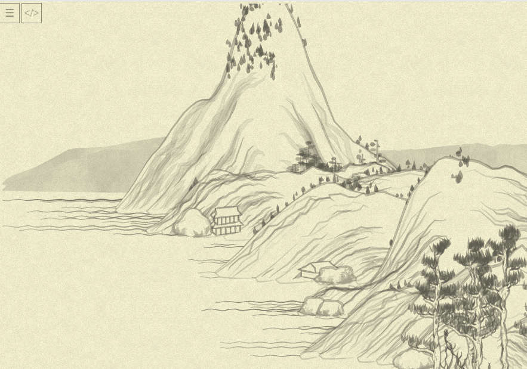
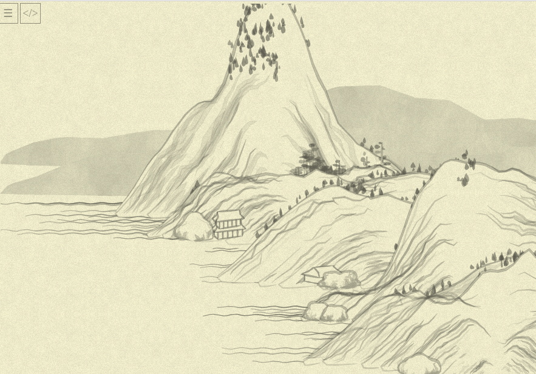

# Day 13: Plan for the mountains

* **Commit:** [297259f](https://github.com/zverok/grok-shan-shui/commit/297259f31e87fa6b7b7d449a6c34897db9c40040)
* **Functions:**
  * [`mountplanner`](https://github.com/zverok/grok-shan-shui/blob/main/original.html#L3706)
* **Other days about:**
  * `mountplanner`: **13**—[14](day14.md)

So, let's crack that `mountplanner` thing!

> Random thing to spend time on: `rand(230, 280)` is NOT the same as `280 - rand(50)` at the same step of the random generator, while looking ... logically the same?... Why?.. (10 min debug). Oh, because while `Math.random()` gives exactly the same value on the same step... `rand(from, to)` would be the same as `230 + rand(50)`, which is NOT the same at all (just replace `rand(50)` with some particular value to check). So, while it is "logically nice to see" `y: rand(230, 280)` where `y: 280 - Math.random() * 50` was, we can't allow that!

Today would be word-low day :) After some time, I managed to _mechanically_ simplify the main function's body to this:

```js
var x_range = range(xmin, xmax, xstep)

x_range.forEach( x => MEM.planmtx[Math.floor(x / xstep)] ||= 0)

x_range.forEach( x => {
  var max_y = yr(x) * 480
  range(0, max_y, 30).forEach( y => {
    if (locmax(x, y, ns, 2)) {
      var x_offset = x + rand(-500, 500);
      var y_offset = y + 300;
      if (chadd({ tag: "mount", x: x_offset, y: y_offset, h: ns(x, y) })) {
        range(Math.floor((x_offset - mwid) / xstep), (x_offset + mwid) / xstep).
          forEach( dx => MEM.planmtx[dx] += 1 )
      }
    }
  })
  if (Math.abs(x) % 1000 < Math.max(1, xstep - 1)) {
    chadd({
      tag: "distmount",
      x: x,
      y: 280 - rand(50),
      h: ns(x, max_y),
    });
  }
})

x_range.forEach( x => {
  if (MEM.planmtx[Math.floor(x / xstep)] == 0) {
    chance(0.01, () => {
      for (var y = 0; y < rand(4); y++) {
        chadd({
          tag: "flatmount",
          x: x + rand(-700, 700),
          y: 700 - y * 50,
          h: ns(x, y),
        });
      }
    })
  }
})

x_range.forEach( x =>
  chance(0.2, () => chadd({ tag: "boat", x, y: 300 + rand(390) }, 400))
)
```

(...as usually, I went through several hoops of "why the heck it does _this_ now?.." but actually much lower amount than I've expected, and they all were trivial/seen before, so I am skipping this part.)

This new form clarifies things a bit (for me! — will I every became tired of adding this clarification?.. please imagine it everywhere), due to pure squashing of details into higher-level atoms. I enhanced our `range` function (which previously could only `range(max)`) to this:

```js
// range(4) => [0, 1, 2, 3]
// range(1, 4) => [1, 2, 3]
// range(1, 10, 2) => [1, 3, 5, 7, 9]
function range(from, to = undefined, step = undefined) {
  if(to == undefined) {
    to = from
    from = 0
  }
  step ||= 1
  var res = []
  for(i = from; i < to; i += step) {
    res.push(i)
  }
  return res;
}
```

> Funny note: here I am rather mimicking Python than Ruby (Ruby-idiomatic way to say "range with begin, end, and step" would be `(1...4).step(2)` or `(1...4) % 2`. This is much more work to reproduce—and without a dedicated range literal Ruby has, this will still be awkward.)

There are a few more things to (slightly) clarify—more or less it looks ready-for-explanation now.

Another thing to probably notice is all cycles are replaced with `range(...).forEach` except for one:

```js
for (var y = 0; y < rand(4); y++) {
  chadd({
    tag: "flatmount",
    x: x + rand(-700, 700),
    y: 700 - y * 50,
    h: ns(x, y),
  });
}
```

It cost me a dear 10 minutes of head-scratching and debugging: once you replace it with (natural, I thought, eh?) this:
```js
range(rand(4)).forEach( y => {
  chadd({
    tag: "flatmount",
    x: x + rand(-700, 700),
    y: 700 - y * 50,
    h: ns(x, y),
  });
})
```

...the picture is suddenly screwed.

Right:



With cool range (notice the background mountains shift, and foreground trees vanishing):



...only after extracting "cycle end" to a variable for debugging I noticed/remembered my C days, and that cycle condition is calculated on _every_ cycle run: so where with `range` we have exactly one call to `random()`, "classic" cycle re-randoms every iteration. It was probably not intended by the original author, but for the sake of preserving the exact picture I put the cycle back.

So... that's that for today.

Tomorrow I want to tackle some of the naming, internal methods like `locmax` (which is obviously `local_maximum`, so maybe just leave it be?) and the interaction with `MEM.planmtx`. It is, again, not too murky (global storage of "already taken" squares of the picture), but maybe it can be more high-level, too?
