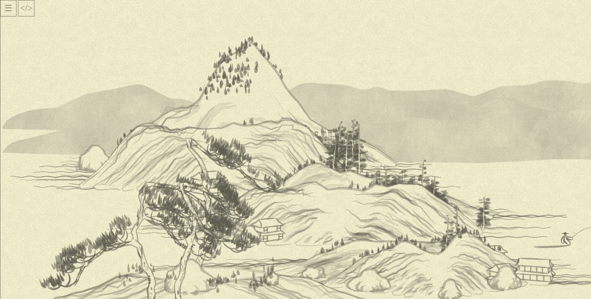
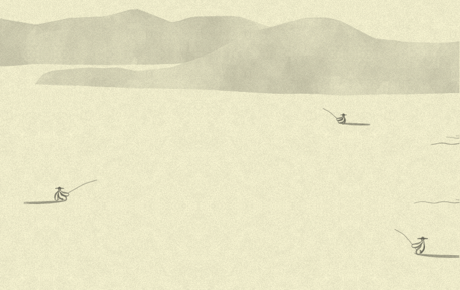

# Day 14: Mountain-planning, continued

* **Commit:** [6ede154](https://github.com/zverok/grok-shan-shui/commit/6ede154618a49cb7ff1b50c5a6a23a273b44d4f3)
* **Functions:**
  * [`mountplanner`](https://github.com/zverok/grok-shan-shui/blob/main/original.html#L3706)
* **Other days about:**
  * `mountplanner`: [13](day13.md)—**14**

Yesterday we did quite a few bad things to `mountplanner`, can we go further, though?

First thing that bothers me is non-atomic operations with `MEM.planmtx`—which is, apparently, a global map of already occupied lines of the map. The repetitive operations I don't like is regularly doing something like `MEM.planmtx[Math.floor(x / xstep)]`, so let's OOP!

Analyzing the interface that is necessary to use `planmtx`, we can come with this:

```js
/* Usage:
  // Array of "is it occupied" data with step 5
  occupied_points = new MountainMap(5)

  // stores 40 zeroes corresponding to range 0-200
  occupied_points.initRange(0, 200)

  occupied_points.get(20)
  occupied_points.isEmpty(20) // true if there is still 0

  // increases by 1 all points corresponding to range 20-40
  occupied_points.incRange(20, 40)
*/
class MountainMap {
  constructor(step) {
    this.data = []
    this.step = step
  }

  get(at) { return this.data[Math.floor(at / this.step)] }
  set(at, value) { this.data[Math.floor(at / this.step)] = value }
  inc(at) { this.data[Math.floor(at / this.step)] += 1 }

  isEmpty(at) { return this.get(at) == 0 }

  initRange(from, to) {
    range(Math.floor(from / this.step), Math.floor(to / this.step)).forEach( i => this.data[i] ||= 0 )
  }
  incRange(from, to) {
    range(Math.floor(from / this.step), Math.floor(to / this.step)).forEach( i => this.data[i] += 1 )
  }
}
```

...and, replacing naked `planmtx` in code with this object, I am proudly presenting you with...



Oh shoot.

It is just ranges definitions (+ 10 more mins of debugging, note `floor`/`ceil` change):
```js
    initRange(from, to) {
      range(Math.floor(from / this.step), Math.ceil(to / this.step)).forEach( i => this.data[i] ||= 0 )
    }
    incRange(from, to) {
      range(Math.floor(from / this.step), Math.ceil(to / this.step)).forEach( i => this.data[i] += 1 )
    }
```

After that, the picture is back to the original (not repeating it, as usual! you just trust me).

Now, the `mountplanner` main body (with the `planmtx` renamed ...and some other renames/cleanups) turns into this:

```js
var xstep = 5;
var mountain_width = 200;

var x_range = range(xmin, xmax, xstep)

MEM.occupied_x ||= new MountainMap(xstep)
MEM.occupied_x.initRange(xmin, xmax)

x_range.forEach( x => {
  var max_y = height_randomizer(x) * 480
  range(0, max_y, 30).forEach( y => {
    if (locmax(x, y, noise, 2)) {
      var x_offset = x + rand(-500, 500);
      var y_offset = y + 300;
      if (chadd({ tag: "mount", x: x_offset, y: y_offset, h: noise(x, y) })) {
        MEM.occupied_x.incRange(x_offset - mountain_width, x_offset + mountain_width)
      }
    }
  })

  if (Math.abs(x) % 1000 < Math.max(1, xstep - 1)) {
    chadd({
      tag: "distmount",
      x: x,
      y: 280 - rand(50),
      h: noise(x, max_y),
    });
  }
})

x_range.
  filter( x => MEM.occupied_x.isEmpty(x) ).
  forEach( x => chance(0.01, () => {
      for (var y = 0; y < rand(4); y++) {
        chadd({
          tag: "flatmount",
          x: x + rand(-700, 700),
          y: 700 - y * 50,
          h: noise(x, y),
        });
      }
    })
  )

x_range.forEach( x =>
  chance(0.2, () => chadd({ tag: "boat", x, y: 300 + rand(390) }, 400))
)

return reg;
```

Now, I don't like `chadd`. I like dynamic languages and prototype-based development (sometimes!) and this:

```js
var registry = [];

registry.pushChunk = function(chunk, min_distance = 10) {
  if(this.find( rchunk => Math.abs(rchunk.x - chunk.x) < min_distance )) {
    return false
  }
  this.push(chunk);
  return true;
}

// now, instead of chadd(...), we can `registry.pushChunk(...)`
```

And, behold, the final `mountplanner`:

```js
function mountplanner(xmin, xmax) {
  function is_local_maximum(x, y, f, {vicinity}) {
    var z0 = f(x, y);
    if (z0 <= 0.3) {
      return false;
    }
    for (var nx = x - vicinity; nx < x + vicinity; nx++) {
      for (var ny = y - vicinity; ny < y + vicinity; ny++) {
        if (f(nx, ny) > z0) {
          return false;
        }
      }
    }
    return true;
  }

  var registry = [];

  registry.pushChunk = function(chunk, min_distance = 10) {
    if(this.find( rchunk => Math.abs(rchunk.x - chunk.x) < min_distance )) {
      return false
    }
    this.push(chunk);
    return true;
  }

  var samp = 0.03;
  var noise = (x, y) => Math.max(Noise.noise(x * samp) - 0.55, 0) * 2;

  var xstep = 5;
  var mountain_width = 200;

  var x_range = range(xmin, xmax, xstep)

  MEM.occupied_x ||= new MountainMap(xstep)
  MEM.occupied_x.initRange(xmin, xmax)

  x_range.forEach( x => {
    var max_y = Noise.noise(x * 0.01, Math.PI) * 480

    range(0, max_y, 30).
      filter( y => is_local_maximum(x, y, noise, {vicinity: 2}) ).
      forEach( y => {
        var x_offset = x + rand(-500, 500);
        var y_offset = y + 300;
        if (registry.pushChunk({ tag: "mount", x: x_offset, y: y_offset, h: noise(x, y) })) {
          MEM.occupied_x.incRange(x_offset - mountain_width, x_offset + mountain_width)
        }
      })

    if (Math.abs(x) % 1000 < xstep - 1) {
      registry.pushChunk({
        tag: "distmount",
        x: x,
        y: 280 - rand(50),
        h: noise(x, max_y),
      });
    }
  })

  x_range.
    filter( x => MEM.occupied_x.isEmpty(x) ).
    forEach( x => chance(0.01, () => {
        for (var y = 0; y < rand(4); y++) {
          registry.pushChunk({
            tag: "flatmount",
            x: x + rand(-700, 700),
            y: 700 - y * 50,
            h: noise(x, y),
          });
        }
      })
    )

  x_range.forEach( x =>
    chance(0.2, () => registry.pushChunk({ tag: "boat", x, y: 300 + rand(390) }, 400))
  )

  return registry;
}
```

Its retelling in human language would be:
* through all range of currently generated chunk
* ...put a "mount(ain)" if it is a local maximum of the (smooth) Perlin noise
* ...and mark the space around as occupied
* once in a thousand `x`s, put a "dist(ant )mount(ain)"
* after all mountains are generated, choose unoccupied points and (with 10% chance) place "flat( )mount(ains)" there
* ....and then, with 20% chance, put boats;
* also, there is a `registry` controlling nothing would be put at exactly same `x` line, this approach reduces possible "computerness" of the picture significantly.

BTW, while experimenting what would increasing boat chance lead to, I caught a nice picture: the arrow points to human figures I haven't even knew this thing is able to generate! (Power tower is a nice touch too, but this one I seen already)


...and in another side of the same picture, indeed, some boats (I increased chances to `1`):



That's ... sweet little experiment. But back on track!

To close the gap between whole landscape planning and singular trees and houses, we need to cover all of those `"mount"/"flatmount"/...` tags processing—functions looking like `Mount.mountain(x, y, rand(i * 2))` which we've seen in day 12, and that's what we'll do tomorrow.
