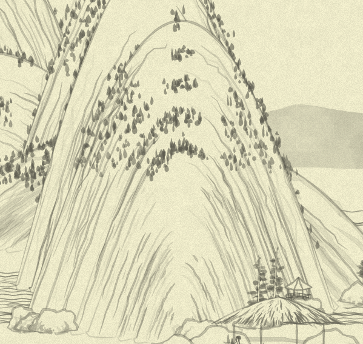
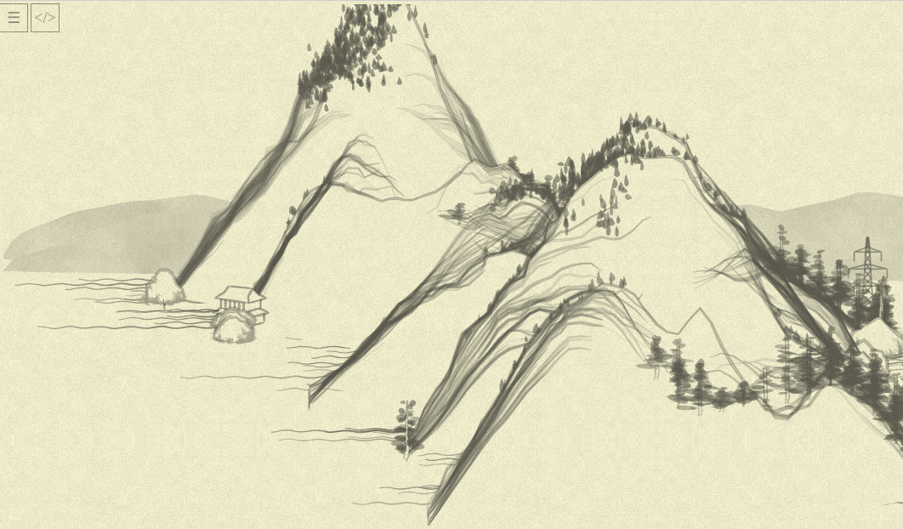

## Day 16: Deeper into the mountain

So... We are looking into the `Mount.mountain` function, its peculiar `y`-first set of points, and its being `vegetate`d with trees, rocks and houses!

Before we'll start to look into a ton of uniform `vegetate` calls, the only drawing constructs that are different there are at the beginning:

```js
//WHITE BG
canv += poly(ptlist[0].concat([[0, resolution.y * 4]]), {
  xof: xoff,
  yof: yoff,
  fil: "white",
  str: "none",
});
//OUTLINE
canv += stroke(
  ptlist[0].map(function(x) {
    return [x[0] + xoff, x[1] + yoff];
  }),
  { col: "rgba(100,100,100,0.3)", noi: 1, wid: 3 },
);

canv += foot(ptlist, { xof: xoff, yof: yoff });
canv += texture(ptlist, {
  xof: xoff,
  yof: yoff,
  tex: tex,
  sha: randChoice([0, 0, 0, 0, 5]),
  col: color,
});
```

Wait, why it takes just first of the `ptlist` to make a background and outline?.. `ptlist` is list of lists of points... Ah, so it is actually _layers_ of the mountain, from top to bottom, from outside to inside. That actually makes the initial `ptlist` generation cycle suddenly clear!


`ptlist[0]` is an outer layer pointed by red arrow, and the rest of `ptlist` items is lines of "texture" layers (pointed be a blue arrow).

And we iterate layers and points, not `y`s and `x`s here!

```js
var resolution = {num_layers: 10, num_points: 50};

var layers = range(resolution.num_layers).map( layer_idx => {
  h_offset += rand(y_offset / 100)
  var expansion = 1 - layer_idx / resolution.num_layers;

  return range(resolution.num_points).map( point_idx => {
    var tilt = (point_idx / resolution.num_points - 0.5) * Math.PI;
    var y = Math.cos(tilt) * Noise.noise(tilt + 10, layer_idx * 0.15, seed);
    return [(tilt / Math.PI) * width * expansion, -y * height * expansion + h_offset]
  })
})
```

So, with each next layer the `expansion` coefficient shrinks from 1 towards 0, making the line of each next layer closer to the mountain center.

`tilt` is monotonously going from `−π/2` to `+π/2` (`−90°` to `+90°`, "straight up" to "straight down"). We can see what this monotonous change of the tilt gives us by temporarily commenting out `* Noise.noise(tilt + 10, layer_idx * 0.15, seed)` in `y` calculation, to see the math figures unobstructed by the noise:



Here is a picture of another experiment for you: if we'll temporarily replace `expansion` calculation with just `expansion = 1`, this would happen (lines aren't shifted towards montain center):



Note that houses, rocks and trees are still recognizable, but all shifted a bit, too: they are attached to points at some layers, as the updated `vegetate` code seems to demonstrate clearly:

```js
function vegetate(treeFunc, growthRule, proofRule) {
  canv += layers.
          flatMap( (layer, l_idx) => layer.filter( (point, p_idx) => growthRule(l_idx, p_idx) ) ).
          and_then( veglist => veglist.filter( (_, i) => proofRule(veglist, i) ) ).
          map( ([x, y]) => treeFunc(x, y) ).
          join()
}
```

Now, with this `layers` revelation, and using our earlier-defined "better" `poly_` and `stroke_`, we can express background and outline this way:

```js
//WHITE BG
canv += poly_([...layers.first, [0, resolution.num_layers * 4]],
              { x_offset, y_offset, fill: "white", stroke: "none" });
//OUTLINE
canv += stroke_(layers.first,
                { x_offset, y_offset, color: rgba(100,100,100,0.3), noise: 1, width: 3 });
```

Two personal notes:

* While there are horizontal place on the screen, I frequently prefer to spend it, at least for trivial stuff, to make the overall picture visible—instead of "one key-value pair per line" structure. It is, like, _one phrase_, why it spans half-a-screen, like some weird children rhyme, so just two phrases take an entire page? (Emphasizing: it is for a _trivial_ stuff, once we have formulae in values, I'd make it more spacious.)
* I am _definitely_ spoiled by Ruby, and used to methods `Array#first` and `Array#last`, designating frequently _special_ items of the array. I already defined a `last()` function a few days ago, but now I wanted my `first` too... and can I have it as a property actually?.. I can!
```js
// [1, 2, 3, 4].first => 1
Object.defineProperty(Array.prototype, 'first', {get: function() { return this[0] }})
```

I am still not exactly sure here what exactly additional point at `[0, resolution.num_layers * 4]` achieves... Removing it seems to change nothing, but maybe it handles some nasty edge case, so I'll be leaving it, just in case.

That's it for today, shorter timespan was available... Also I am traveling tomorrow, so I am not sure there would be an entry for the day.

> Note to self: Victor, you are writing it privately and plan to publish all in one bunch, why are you pretending you are communicating with some "subscribes" now?.. No idea, honestly! Maybe trying my voice before some next, more serious endeavor.

Anyway, the next _active_ day I'll be trying to make `vegetate` usage more clear (to me, to me, to my poor sleepy head!)
