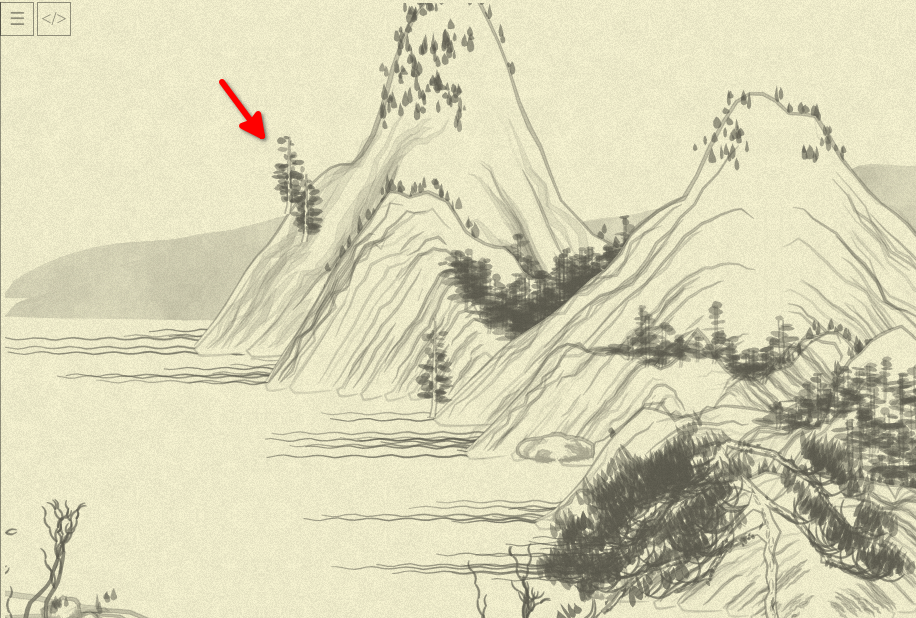

## Day 17: Let's Vegetate!

I am in Istanbul now. Always loved the city, it is an absolute beauty (I half-dream of some _generative art_ project which could've imitate the cozy narrow streets of Kadıköy... But we digressed.)

Today, I want to look into `vegetate` method usage in the `Mount.mountain` and see if I can understand it better. By rewriting, of course.

First, I am changing its protocol to this:

```js
function generate(objectFunc, {if: pointSelector, pointFilter = () => true}) {
```
...making names more generic, and calls more obvious (and removing the need to pass the trivial no-op second filter).

Now we can start to update methods in this style:

```js
//RIM
generate(
  (x, y) => Tree.tree02(x + x_offset, y + y_offset - 5, {
    color: rgba(100,100,100, Noise.noise(0.01 * x, 0.01 * y) * 0.5 * 0.3 + 0.5),
    clu: 2,
  }),
  {if: (layerIdx, pointIdx) => layerIdx == 0 &&
                               Noise.noise(pointIdx * 0.1, seed)**3 < 0.1 &&
                               Math.abs(layers[layerIdx][poinIdx][1]) / height > 0.2},
);
```

(Ugh, I know I am jumping between `foo_bar` naming I am usually doing in Ruby and `fooBar` naming more common in JS... Probably I'll need to cleanup this laterz!)

Note that with naming it `layerIdx` instead of `i`, the first part of the condition becomes more clear: "this particular object should be generated only at the first, outer, layer." The comment `// RIM` implies the same!

And, as I've already suspected, those "if this should be drawn" function can look simpler if we'll pass current point itself as the third argument:

```js
// in generate:
flatMap( (layer, l_idx) => layer.filter( (point, p_idx) => pointSelector(l_idx, p_idx, point) ) ).
                                                                                    // ^^^^^
// and in this call:
{if: (layerIdx, pointIdx, point) => layerIdx == 0 &&
                                    Noise.noise(pointIdx * 0.1, seed)**3 < 0.1 &&
                                    Math.abs(point[1]) / height > 0.2},

```

Two notes-to-self that I would like to address if I had infinite time to polish, which I do not:
1. `point[1]` would be much better have as `point.y`... everywhere. A lot of things to rewrite, though, I'll pass. Probably can be solved with more unpacking in function args (e.g. `[_, y]` instead of `point`)?..
2. Personal thing, probably, but I really hate the `Math.` prefix for trivial things like `abs` or `floor`. The names are base and absolutely clear even without the prefix, and it just adds visual noise. Whatevs.

Now, going through all the function calls (and with surprisingly low amount of probems to debug, save for stray `j is not defined` where I've forgot to rename something), I am gradually coming to understand what we need from `generate` even better. Though, one "wrong picture" still got there:



...but comparing it to expected, I quickly saw that probably the problem started with call that generates `tree03` (remembering how the trees looks from early days), I quickly got the typo (at some point I just replaced `layer.length` check with `layers.length` accidentally, and math got all wrong... though this one might make the man thinking!)

So, here is the the final version of the function:

```js
function generate(objectFunc, {if: pointSelector, pointFilter = points => points}) {
  canv += layers.
          flatMap( (layer, layerIdx) =>
            layer.filter( (point, pointIdx) => pointSelector(layerIdx, pointIdx, {layer, point}) )
          ).
          and_then(pointFilter).
          map( ([x, y]) => objectFunc(x, y) ).
          join()
}
```

Note that instead having `pointFilter` responsible to saying "whether THIS point is necessary", I moved all the responsibility of "filter this list of points" there—considering its usage, it makes things much clearer.

Now, I am super-tired after the flight (it was delayed for 2 hours, and it is actually phisical "day 18" already...), so I'll finish with all the actual calls to `generate` and how they are express things now, tomorrow. Hopefully. With Istanbul, you never actually know!
