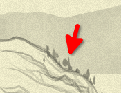
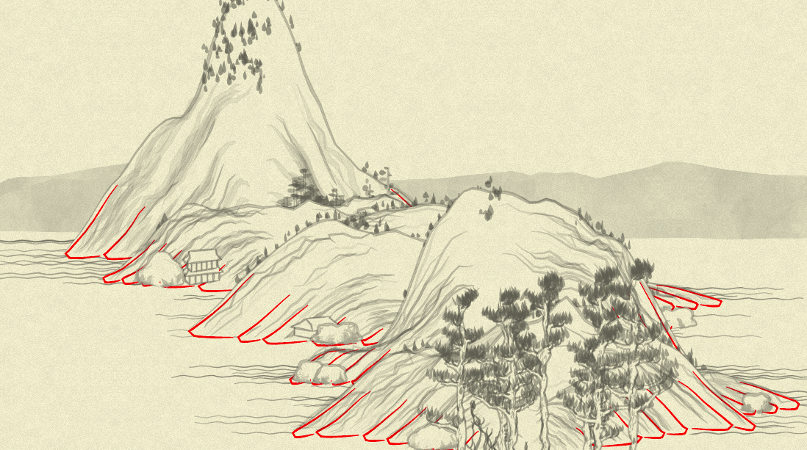
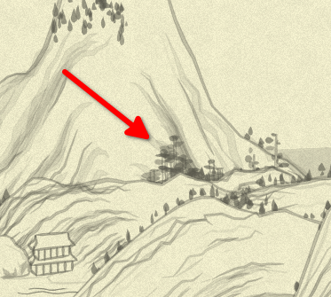

## Day 18: Generation details

So, yesterday we made initial `vegetate` generator function into fully-rewritten `generate`, and today let's see it applied.

There are a lot of things to micro-simplify now in `generate` calls to expose the structure. Some values are repeating several times and _might_ be meaningful to extract into constants/variables. Some random-value generation is pleasant to change from `40 + Math.random() * 20` to `rand(40, 60)` making it explicit.

So, that's what our `generate` calls be looking like now, with some comments (in the same order they appear in the function):

```js
//RIM
generate(
  (x, y) => Tree.tree02(x + x_offset, y + y_offset - 5, {color: treeColor(x, y, 0.5), clu: 2}),
  {if: (layerIdx, pointIdx, {point: [_, y]}) =>
        layerIdx == 0 && Noise.noise(pointIdx * 0.1, seed)**3 < 0.1 && Math.abs(y) / height > 0.2},
);
```

Before we start to draw the mountain itself, we insert some `tree02`s—these guys:



...then the `poly_` of the background, and the `stroke_` of the border are happening on top of them, to make an effect we see some of the trees growing behind the mountain rim... which is not always working (even on this small slice above one can see a tree "hanging" in the air). But that's how it works on the original picture, too.

Other things of interest here:
* conditions of drawing: only on the first layer (explained above)
* only cover the top 20% of the mountain (`y`'s value is `0` at the very bottom, and `1*height` at the very top of the mountain)
* noise condition (which is present for each tree in some or other form) is, honestly, somewhat opaque to me. Considering the meaning of the Perlin noise (change smoothly between neighbor points), it probably dedicated to have "naturally looking" groups of trees, and the various coefficients seem to be just hand-picked by the original author via trial and error?.. I am not totally sure.

`treeColor` is defined like this (because it repeats many times):

```js
var treeColor = (x, y, shift = 0.3) => rgba(100,100,100, Noise.noise(0.01 * x, 0.01 * y) * 0.5 * 0.3 + shift)
```

Next, we have in function's code (skipping the details of the arguments:

```js
//WHITE BG
canv += poly_(layers.first, ...);
//OUTLINE
canv += stroke_(layers.first, ...);
canv += foot(layers, ...);
canv += texture(layers, ....);
```

As we already know, `poly_` does the background of the whole mountain, `stroke_` its outline, and `texture`-pleasantly-looking internal lines for some of the layers.

`foot` I can probably guess by its name... But not sure, honestly. So I'm color-debugging it by looking into its code and replacing the color of the `stroke` it does with bright red:

```diff
+        Math.random()
         canv += stroke(
           ftlist[j].map(function(x) {
             return [x[0] + xof, x[1] + yof];
           }),
           {
-            col:
-              "rgba(100,100,100," +
-              (0.1 + Math.random() * 0.1).toFixed(3) +
-              ")",
+            col: 'rgba(255,0,0)',
             wid: 1,
```
Note that we need effectless `Math.random` to not break the randomness count (compensate for `Math.random` that was previously called in color calculation), or it will change the entire picture, again. The result:



Q.E.D.: `foot` generates footer lines for mountains! What a revelation.

Next is, we generate a bit more of `tree02` for the mountain rim, now in front of its contour (ugh, so on a small picture above, some of the pine-like trees might've been from this call):

```js
//TOP
generate(
  (x, y) => Tree.tree02(x + x_offset, y + y_offset, { color: treeColor(x, y, 0.5) }),
  {if: (layerIdx, pointIdx, {point: [_, y]}) =>
       Noise.noise(layerIdx * 0.1, pointIdx * 0.1, seed + 2)**3 < 0.1 && Math.abs(y) / height > 0.5},
);
```
We don't limit it by "only first layer", and allow to cover top 50% of the mountain.

Now, to the complicated one:

```js
//MIDDLE
generate(
  (x, y) => Tree.tree01(x + x_offset, y + y_offset, {
    height: ((height + y) / height) * 70 * rand(0.3, 1.0),
    width: rand(1, 4),
    color: treeColor(x, y),
  }),
  {if: (layerIdx, pointIdx, {point: [_, y]}) =>
        pointIdx % 2 &&
        Noise.noise(layerIdx * 0.2, pointIdx * 0.05, seed)**4 < 0.012 &&
        Math.abs(y) / height < 0.3,
  pointFilter: points =>
               points.filter( ([x, y], i) =>
                 points.countIf(([ox, oy], oi) => oi != i && Math.sqrt((x - ox)**2 + (y - oy)**2) < 30) > 2
               )},
);
```

It is this kind of trees:



A few tricky things here:
* range of `(height + y) / height`: considering the `y` is negative in range `-height..0`, it goes from 0 (when `y = -height`) at the top of the mountain to 1 (when `y=0`) at the bottom. So, the range of the tree height is actually up to 70 pixels (when it is very bottom of the mountain, and `rand` returned exactly 1), also it is randomized and decreasing towards the top;
* width is just random, being able to produce all kind of tall-yet-thin and short-and-wide trees with any variety in between;
* the `if:` condition is: lower than top 30% of the mountain; and only every second point, plus some noise;
* this is the only function that uses the second filter; I did my best to make what it does obvious, and now it says (even if in a quite long phrase): use only those point, which have in the whole set of chosen points more than two close neighbors (close = distance between them is less than 30 pixels).

`countIf` is defined simply:

```js
Array.prototype.countIf = function(fun) { return this.filter(fun).length }
```

One last (for today) note about "did my best to make what it does obvious": the code is now spoken in short phrases, but I can't say it exposes _meaning_ in the easiest way: for example, I am leaving the whole hypotenuse calculation for being recognized by the reader—while we can also think about "explaining" it this way:

 ```js
points.filter( point => points.countIf(otherPoint => otherPoint != point && distance(point, otherPoint) < 30) > 2)
 ```
...which is saying it all out loud, but introduces a bit more indirection.

Another thing that I needed to explain—even to myself, as I didn't get it _momentarily_ from the code is the possible range of `(height + y) / height`. Again, be it "business code", I'd maybe go with an explanatory-named—but how named?—function of `y`. Maybe these would've helped?

```js
// first, abstract out "percent of distance from the bottom"
var pctFromBottom = (y) => Math.abs(y) / height

// and now, instead of...
Math.abs(y) / height < 0.3
// ...we can say
pctFromBottom(y) < 0.3

// and next:
var pctFromTop = (y) => (height + y) / height
// with now the `height` of the tree becoming trivial:
height: pctFromTop(y) * 70 * rand(0.3, 1.0)
```

This still requires a bit of thinking, but communicates "it is higher when the percent from top is higher" much better.

What bothers me, though, is introducing new functions—with whatever good names we might come with, and I would first to admit `pct...` is not too good ones—increases complexity of the comprehension too. But now we make the complexity opaque: while `sqrt((x1-x2)**2 + (y1-y2)**2)` takes some time to read and recognize, it is recognizable unequivocally: hypotenuse, distance between two points in a flat Euclidean space. Now, "simplifying" it to `distance(point1, point2)` we both expose the meaning, and cover it: what exact "distance" is it? Just geometrical one, or, considering all the complexities of the current context, maybe it is some "distance between layers", or "distance with random noise introduced", or...

So, it is always a trade-off, and I observe that algorithm-hard code tends to prefer explicit ways of saying "what's going on", and this I follow. (With one _huge_ indulgence to myself: I allow my "what can be done with collections" intuition to whisper to me things like `Array.prototype.countIf` and others alike—but here, I am just copying my "natural" dictionary after 15 years of Ruby usage; and I, again, would be first to agree that this dictionary might not be natural for some. But it is _my_ hobby project, OK?)

With the work on the `mountain` function half-finished—and more words in this diary than any previous day—I'll conclude.
