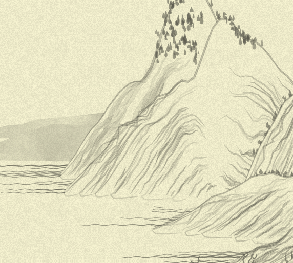
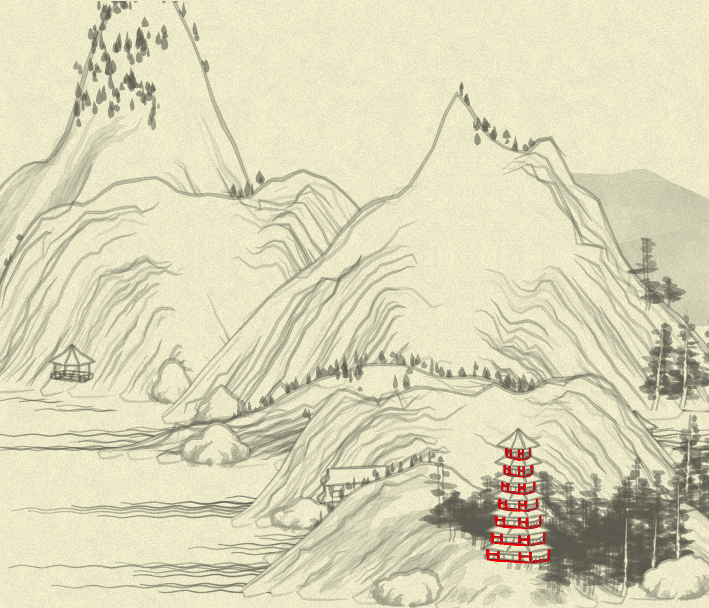

# Day 19: Wrapping up the mountain

* **Commit:** [0593c97](https://github.com/zverok/grok-shan-shui/commit/0593c97cbe4dd5f15c5b9c23b3e733f14ccc56ec)
* **Functions:**
  * [`Mount.mountain`](https://github.com/zverok/grok-shan-shui/blob/main/original.html#L1804)
* **Other days about:**
  * `mountain`: [15](day15.md)—[16](day16.md)—[17](day17.md)—[18](day18.md)—**19**—[20](day20.md)

So... After yesterday philosophical explosion (sorry!), today I'll continue to handle the `mountain` statements one-by-one.

Here, the weirdness waits. In he next statement, the tree-generation function, after some simplifications, looks like this (and produces the same old picture):

```js
(x, y) => {
  var ht = ((height + y) / height) * 120 * rand(0.5, 1.0);
  var bc = rand(0.1)
  return Tree.tree03(x + x_offset, y + y_offset, {
    height: ht,
    bending: (x) => x * bc,
    color: treeColor(x, y),
  });
}
```

It seems obvious that `ht` and `bc` are not that precious names, so we might inline the calculations:

```js
(x, y) => Tree.tree03(x + x_offset, y + y_offset, {
            height: ((height + y) / height) * 120 * rand(0.5, 1.0),
            bending: (x) => x * rand(0.1),
            color: treeColor(x, y),
          })
```
...right?

But this breaks everything!



Should be "randomness order" again, but I believe I never changed order of calls here... Oh, not so fast. In `bending` argument, we are actually passing a function, which `tree03` will call several times, so the balance of randomness will change, after all!

So, the next tree will be (note we can't inline `tree_height` calculation now—it would be calculated after `bending_coef`, which again will change order of randomness)...

```js
//BOTTOM
generate(
  (x, y) => {
    var tree_height = ((height + y) / height) * 120 * rand(0.5, 1.0)
    var bending_coef = rand(0.1)
    return Tree.tree03(x + x_offset, y + y_offset, {
      height: tree_height,
      bending: (x) => x * bending_coef,
      color: treeColor(x, y),
    });
  },
  {if: (layerIdx, pointIdx, {layer}) =>
       (pointIdx == 0 || pointIdx == layer.length - 1) &&
       Noise.noise(layerIdx * 0.2, pointIdx * 0.05, seed)**4 < 0.012},
);
```

The condition here limits the tree to appear only at first or last points of the layer (plus, some random noise, as usual).

Next item, after some simplification/cleanup, looks like this (not a final version yet!):

```js
//BOTT ARCH
generate(
  (x, y) => {
    switch(randChoice([0, 0, 1, 1, 1, 2])) {
    case 1:
      return Arch.arch02(x + x_offset, y + y_offset, seed, {
        width: normRand(40, 70),
        stories: randChoice([1, 2, 2, 3]),
        rotation: Math.random(),
        style: randChoice(['t_shapes', 'fence', 'grid']),
      });
    case 2:
      return Arch.arch04(x + x_offset, y + y_offset, seed, {sto: randChoice([1, 1, 1, 2, 2])});
    default:
      return "";
    }
  },
  {if: (layerIdx, pointIdx, {layer}) =>
       layerIdx != 0 && (pointIdx == 1 || pointIdx == layer.length - 2) &&
       Noise.noise(layerIdx * 0.2, pointIdx * 0.05, seed + 10)**4 < 0.008},
);
```

There are quite a few things of interest here.

First is `normRand`. What is `normRand`?

```js
function normRand(m, M) {
  return mapval(Math.random(), 0, 1, m, M);
}
//...whilst mapval is defined as
function mapval(value, istart, istop, ostart, ostop) {
  return (
    ostart + (ostop - ostart) * (((value - istart) * 1.0) / (istop - istart))
  );
}
```
Oh. Compare it with the `rand` I once defined, too:
```js
function rand(from, to=undefined) {
  if (to == undefined) {
    to = from;
    from = 0;
  }
  return Math.random() * (to - from) + from
}
```
So... They are basically the same. Seems like the original author at some point got tired of `start + Math.random() * size` non-atomicity too. Great minds think alike, right?..

Another interesting thing is that `switch(randChoice([0, 0, 1, 1, 1, 2]))`: it splits probability in 6 part, and gives 2/6 probability of nothing would be drawn (0), 3/6 of `arch02` (1), and 1/6 of `arch04` (2).

We might try to spell it this way (with some invented syntax like `probability(6, {1/6: ()=> ... arch02, 2/6: => ...arch04})`), but that would be too awkward for pretty small gain.

So, after some consideration, I'll just leave it be (replacing `normRand` with just `rand` for consistency).

Next:
```js
//TOP ARCH
generate(
  (x, y) => Arch.arch03(x + x_offset, y + y_offset, seed, {sto: randChoice([5, 7]), wid: rand(40, 60)}),
  {if: (layerIdx, pointIdx, {layer}) =>
       layerIdx == 1 && Math.abs(pointIdx - layer.length / 2) < 1 && chance(0.02)},
);
```

Here, I can't resist the temptation and replaced `Math.random() > 0.02` with `chance(0.02)` (we already had a `chance` function, I just improved it a bit to allow this simple call).

`Math.abs(pointIdx - layer.length / 2) < 1` is another case of the statement that both pretty trivial, but also "wait what"-causing a bit. What does it mean? My mathematically-lazy head needs some scratching. `pointIdx` goes from `0` to `layer.length` (which is actually always `resolution.num_points` = 50... So we might've used this number or that variable instead of passing the `layer` everywhere!). So, `pointIdx - layer.length / 2` goes from `-25` to `+25`. And indexes are integer. So, the only case when `Math.abs(pointIdx - layer.length / 2) < 1` is true is... wait... `pointIdx - 25 == 0`, e.g. `pointIdx` == 25. Ugh.

```js
//TOP ARCH
generate(
  (x, y) => Arch.arch03(x + x_offset, y + y_offset, seed, {sto: randChoice([5, 7]), wid: rand(40, 60)}),
  {if: (layerIdx, pointIdx) => layerIdx == 1 && pointIdx == resolution.num_points / 2 && chance(0.02)},
);
```

I needed to debug this revelation, but `arch03` is actually quite rare. I changed its color to red... and nowhere on the picture it be seen. So, I temporarily removed the `layerIdx == 1 && ` subcondition to have more of those. It would screw up the randomness, of course, but I need only compare this _new_ (with screwed randomness) picture for staying the same when I replace `Math.abs(pointIdx - layer.length / 2) < 1` with simpler version.

Well.... It does. For the reference, test picture looks like this:



> Note that my simplification relies on the fact that `num_points` is known to be even (while the original statement will work with both even and odd); and using resolution instead of `layer.length`—which I'll go back and replace everywhere now, actually—relies on the fact that all layers are of the same size. I suppose during the creative work of the original author they have tried many different approaches and varieties, and more "resilient" versions of functions totally make sense. So, in no way I am saying "the code was written bad, I rewrote it good". The only idea behind what I do is to improve _my_ understanding—and hopefully, an understanding of the curious reader—how this particular code might do what it does. And for that, some shortcuts are actually not that bad.

So, the rest of `generate` calls in the `mountain` function bring no new things to talk about:

```js
//TRANSM
generate(
  (x, y) => Arch.transmissionTower01(x + x_offset, y + y_offset, seed),
  {if: (layerIdx, pointIdx) => layerIdx % 2 == 0 &&
                               (pointIdx == 1 || pointIdx == resolution.num_points - 2) &&
                               Noise.noise(layerIdx * 0.2, pointIdx * 0.05, seed + 20 * Math.PI)**4 < 0.002},
);

//BOTT ROCK
generate(
  (x, y) => Mount.rock(x + x_offset, y + y_offset, seed, {wid: rand(20, 40), hei: rand(20, 40), sha: 2}),
  {if: (layerIdx, pointIdx) => (pointIdx == 0 || pointIdx == resolution.num_points - 1) && chance(0.1)},
);
```

Tomorrow, I'll finalize the `mountain` in general and comment on the final result. Sleeeeeep.
