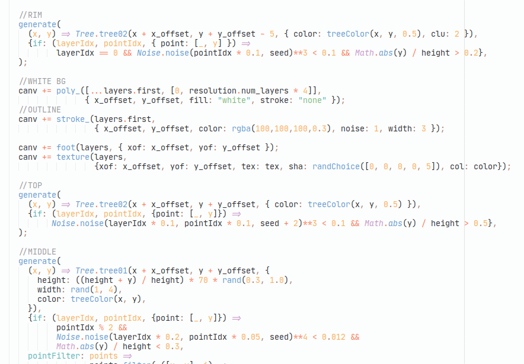
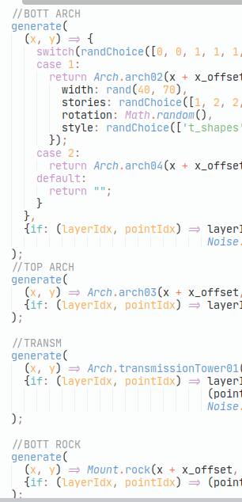

# Day 20: REALLY wrapping up the mountain

* **Commit:** [a85eebb](https://github.com/zverok/grok-shan-shui/commit/a85eebbb4670968ef17fb84bff0ba94d7e0d9a74)
* **Functions:**
  * [`Mount.mountain`](https://github.com/zverok/grok-shan-shui/blob/main/original.html#L1804)
* **Other days about:**
  * `mountain`: [15](day15.md)—[16](day16.md)—[17](day17.md)—[18](day18.md)—[19](day19.md)—**20**

So, that's what we have by this time in `Mountain.mountain`—one of the biggest points-of-entry to the entire picture, which (alongside `flatMount` and `water`) generates the most of the landscape.

It goes like this (I removed a few more of the debugging params and `if`s no current code uses):

```js
this.mountain = function(x_offset, y_offset, seed = 0,
  {height = rand(100, 500), width = rand(400, 600), tex = 200, color}
) {
  var canv = "";

  var resolution = {num_layers: 10, num_points: 50};

  var h_offset = 0;
  var layers = range(resolution.num_layers).map( layer_idx => {
    h_offset += rand(y_offset / 100)
    var expansion = 1 - layer_idx / resolution.num_layers;

    return range(resolution.num_points).map( point_idx => {
      var tilt = (point_idx / resolution.num_points - 0.5) * Math.PI;
      var y = Math.cos(tilt) * Noise.noise(tilt + 10, layer_idx * 0.15, seed);
      return [(tilt / Math.PI) * width * expansion, -y * height * expansion + h_offset]
    })
  })

  function generate(objectFunc, {if: pointSelector, pointFilter = points => points}) {
    canv += layers.
            flatMap( (layer, layerIdx) =>
              layer.filter( (point, pointIdx) => pointSelector(layerIdx, pointIdx, {point}) )
            ).
            and_then(pointFilter).
            map( ([x, y]) => objectFunc(x, y) ).
            join()
  }

  var treeColor = (x, y, shift = 0.3) => rgba(100,100,100, Noise.noise(0.01 * x, 0.01 * y) * 0.5 * 0.3 + shift)

  //RIM
  generate(
    (x, y) => Tree.tree02(x + x_offset, y + y_offset - 5, { color: treeColor(x, y, 0.5), clu: 2 }),
    {if: (layerIdx, pointIdx, { point: [_, y] }) =>
          layerIdx == 0 && Noise.noise(pointIdx * 0.1, seed)**3 < 0.1 && Math.abs(y) / height > 0.2},
  );

  //WHITE BG
  canv += poly_([...layers.first, [0, resolution.num_layers * 4]],
                { x_offset, y_offset, fill: "white", stroke: "none" });
  //OUTLINE
  canv += stroke_(layers.first,
                  { x_offset, y_offset, color: rgba(100,100,100,0.3), noise: 1, width: 3 });

  canv += foot(layers, { xof: x_offset, yof: y_offset });
  canv += texture(layers,
                  {xof: x_offset, yof: y_offset, tex: tex, sha: randChoice([0, 0, 0, 0, 5]), col: color});

  //TOP
  generate(
    (x, y) => Tree.tree02(x + x_offset, y + y_offset, { color: treeColor(x, y, 0.5) }),
    {if: (layerIdx, pointIdx, {point: [_, y]}) => Math.abs(y) / height > 0.5 &&
                                                  Noise.noise(layerIdx * 0.1, pointIdx * 0.1, seed + 2)**3 < 0.1},
  );

  //MIDDLE
  generate(
    (x, y) => Tree.tree01(x + x_offset, y + y_offset, {
      height: ((height + y) / height) * 70 * rand(0.3, 1.0),
      width: rand(1, 4),
      color: treeColor(x, y),
    }),
    {if: (layerIdx, pointIdx, {point: [_, y]}) =>
         pointIdx % 2 &&
         Noise.noise(layerIdx * 0.2, pointIdx * 0.05, seed)**4 < 0.012 &&
         Math.abs(y) / height < 0.3,
    pointFilter: points =>
                 points.filter( ([x, y], i) =>
                   points.countIf(([ox, oy], oi) => oi != i && Math.sqrt((x - ox)**2 + (y - oy)**2) < 30) > 2
                 )},
  );

  //BOTTOM
  generate(
    (x, y) => {
      var tree_height = ((height + y) / height) * 120 * rand(0.5, 1.0)
      var bending_coef = rand(0.1)
      return Tree.tree03(x + x_offset, y + y_offset, {
        height: tree_height,
        bending: (x) => x * bending_coef,
        color: treeColor(x, y),
      });
    },
    {if: (layerIdx, pointIdx) => (pointIdx == 0 || pointIdx == resolution.num_points - 1) &&
                                 Noise.noise(layerIdx * 0.2, pointIdx * 0.05, seed)**4 < 0.012},
  );

  //BOTT ARCH
  generate(
    (x, y) => {
      switch(randChoice([0, 0, 1, 1, 1, 2])) {
      case 1:
        return Arch.arch02(x + x_offset, y + y_offset, seed, {
          width: rand(40, 70),
          stories: randChoice([1, 2, 2, 3]),
          rotation: Math.random(),
          style: randChoice(['t_shapes', 'fence', 'grid']),
        });
      case 2:
        return Arch.arch04(x + x_offset, y + y_offset, seed, {sto: randChoice([1, 1, 1, 2, 2])});
      default:
        return "";
      }
    },
    {if: (layerIdx, pointIdx) => layerIdx != 0 && (pointIdx == 1 || pointIdx == resolution.num_points - 2) &&
                                 Noise.noise(layerIdx * 0.2, pointIdx * 0.05, seed + 10)**4 < 0.008},
  );
  //TOP ARCH
  generate(
    (x, y) => Arch.arch03(x + x_offset, y + y_offset, seed, {sto: randChoice([5, 7]), wid: rand(40, 60)}),
    {if: (layerIdx, pointIdx) => layerIdx == 1 && pointIdx == resolution.num_points / 2 && chance(0.02)},
  );

  //TRANSM
  generate(
    (x, y) => Arch.transmissionTower01(x + x_offset, y + y_offset, seed),
    {if: (layerIdx, pointIdx) => layerIdx % 2 == 0 &&
                                 (pointIdx == 1 || pointIdx == resolution.num_points - 2) &&
                                 Noise.noise(layerIdx * 0.2, pointIdx * 0.05, seed + 20 * Math.PI)**4 < 0.002},
  );

  //BOTT ROCK
  generate(
    (x, y) => Mount.rock(x + x_offset, y + y_offset, seed, {wid: rand(20, 40), hei: rand(20, 40), sha: 2}),
    {if: (layerIdx, pointIdx) => (pointIdx == 0 || pointIdx == resolution.num_points - 1) && chance(0.1)},
  );

  return canv;
};
```

Whooop. 131 lines. Given, it is one of the main, and the largest, functions to "generate everything".

Now, a bunch of random notices to say about it, in no particular order:

1\. In a cases like this, I prefer (as one might've noticed!) **dense code and long lines**. My Sublime is set to have an on-screen rulers marking line length 100—which I consider a soft-ish limit to "go behind that if you really need to", and at 120—which is self-imposed hard limit, "never go behind that". This, in particular, means that on my old 13" ThinkPad I never need to use horizontal scrolling... which explains the limits.

This approach to formatting might be considered unusual for some codebases (or even grave sin), but maybe you'll understand why I am striving for it: this way, on the very same old 13" laptop this what I can see on my full screen height:


...e.g. like, half of the whole logic of the function: "let's generate these trees, then polygon, then stroke, ... etc.". And for quick eye-scanning, the obvious accent is made on "_this_ is generated _here_":



2\. If I'd only go for a full rewrite (which would probably require a couple more _advents_, and as such is even more impractical than what I am doing currently), and I had time for all the functions big and small, a lot of things could be **clarified on a micro-level**, like, IDK,

```diff
- canv += texture(layers,
-                 {xof: x_offset, yof: y_offset, tex: tex, sha: randChoice([0, 0, 0, 0, 5]), col: color});
+ canvas += texture(layers,
+                  {x_offset, y_offset, color, density: textureDensity, shading: randChoice([0, 0, 0, 0, 5])});
```
e.g. name meaning clarification, consistent naming between functions (allowing shortcut syntax for passing similarly named arguments).

3\. I'd really like (and actually might still do) to **give a names to all the houses and trees** (I like the sounding of this phrase!). Even with dense structure, it is really hard for me to to tell what's what to tell `tree01` of `tree02` and of `arch01`. The good names for each of them, maybe that would be next step? But this would require to choose names one would quickly recognize and associate with a picture, ugh (can you tell maple tree from oak by 50-pixel grayscale pictogram?)

4\. Try as I might, there is still a lot of repetitive patterns that are taking more of a screen space and attention that I'd intuitively give to them. Coming from a background of very OO language (by which I mean less "inheritance-encapsulation-polymorphism" and more "small objects as a way of organize everything") and mostly business-logic code, my knee-jerk reaction is change every highly-repetitive `(pointIdx == 0 || pointIdx == resolution.num_points - 1)` (56 characters, and, what's worse, 4 operations, three variables and two numbers) to some kind of `point.end_of_layer?` (yes, Ruby methods allow names ending in `?` and I think it is beautiful). It _means_ logically one atomic check, and should it not look this way?

I already bragged a bit about this a couple of days ago (remember `hypotenuse`?) and I still not really happy but don't see a "natural" solution to all of these `pointIdx` and `layerIdx` checks, and all of the `Noise.noise(...)**power < number`. Oh, and I still hate `Math.` prefix.

***

And on this indecisive note I'll leave the function as it got. Tomorrow I'll start thinking about how the best to wrap up this tiresome and still fascinating investigation in some way that will be at least _somewhat_ publishable. Not sure it would be easy, or even really reachable goal, but I'll need some closure, won't I?
