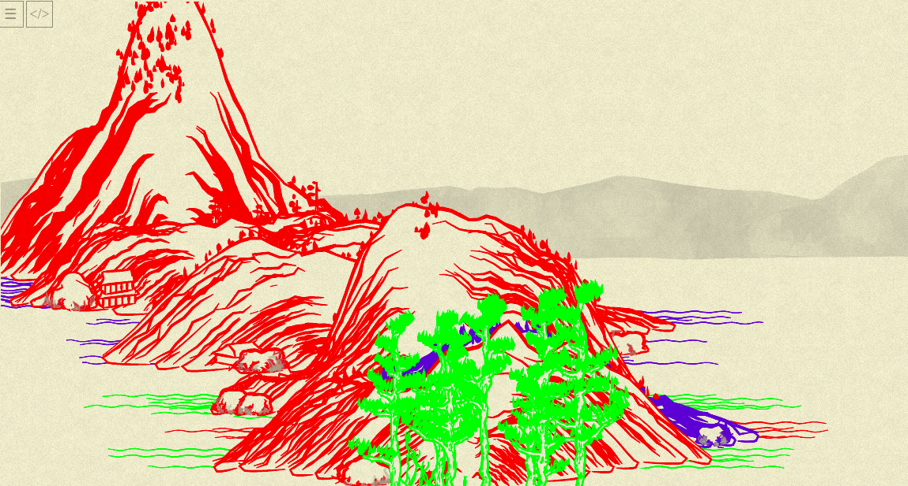
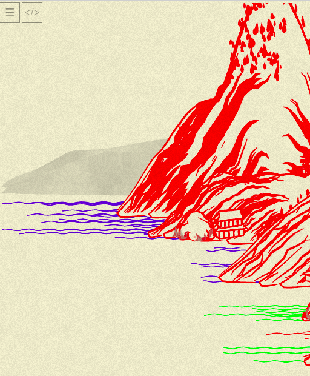
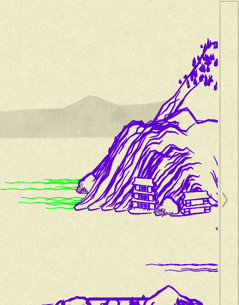
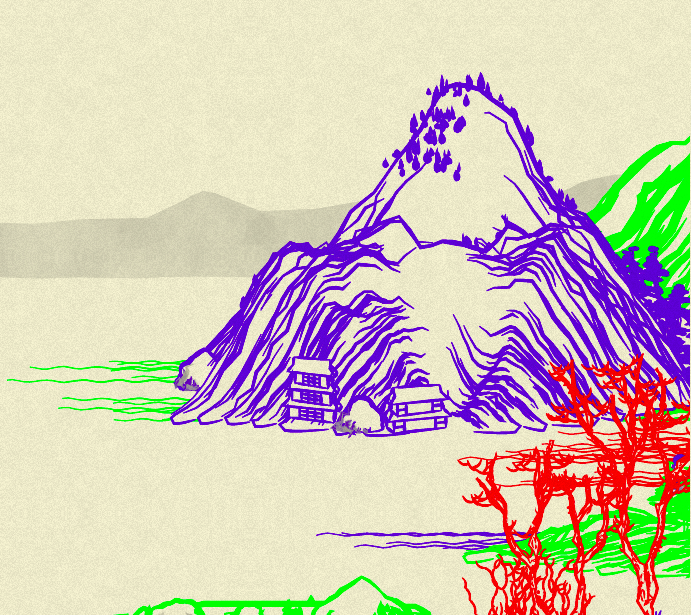
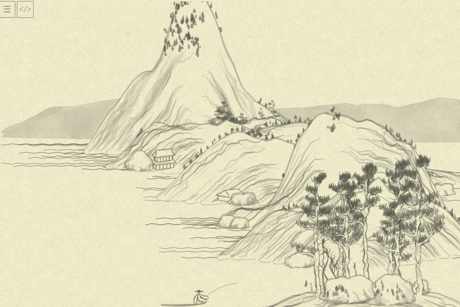

## Day 22: Where were we?..


TBH, it is actually already 2 in the morning of day 23, and I am in airport with a terrible headache; but I still have 40 min till the bus, so why not to pretend at least I am doing something ~~useful~~ interesting?..

So, just one quick experiment: I am not sure how different chunks of the landscape are attached to each other to produce a smooth picture.

I wanted to debugg it for a bit. As almost all of the "hand-drawing" lines have colors like `rgba(100,100,100,<opacity>)`, we can do quite brutal thing (temporary!):

```js
function chunkrender(xmin, xmax) {
  var colors = ['rgba(255, 0, 0)', 'rgba(0, 255, 0)', 'rgba(0, 0, 255)']
  return STATE.chunks
         .filter( chunk => xmin - CONFIG.chunkWidth < chunk.x && chunk.x < xmax + CONFIG.chunkWidth )
         .map( (chunk, i) => chunk.canvas.replaceAll(/rgba\(100,100,100.*?\)/g, colors[i % 3]) )
         .join()
}
```

E.g., each next chunk would be re-colored into bright red, green or blue.

Here's the result (beginning of the picture):



So — OK, the chunks are intersecting: remember `chunkloader`: it puts in one square several objects `mountplanner` mount-planned, and each of them is a chunk.

But, what I find more interesting, is that `CONFIG.chunkWidth` (the one iteration of `chunkloader` call) is this, 512 px:



...but as you may see, the mountains are NOT ending suddenly at this point. So, for all I understand, the mountains are intentionally designed to span outside of the particular iteration `(xmin, xmax)` where they were "planned" overlap each other, and at the end of the current view-port, we actually have more mountains already drawn, but not shown (that's an end of initially loaded picture):



...and when we press `>` to load more, new items are generated, but also that one on the edge becomes fully visible:



This "current view-port" (that hides part of the already generated) is easy to discover now when we asked the question: it is calculated by `calcViewBox` (gasp):

```js
function calcViewBox() {
  var zoom = 1.142;
  return `${STATE.cursorX} 0 ${CONFIG.windowWidth / zoom} ${CONFIG.windowHeight / zoom}`;
}
```

(The code is already rewritten "my way").

`STATE.cursorX` is necessary instead of just `0` because the canvas can be expanded both ways (to negative `x`s, too!).

But what about `zoom`? What if I change it to, IDK, just 1? Surprisingly enough, it actually zooms:



(Shame I haven't discovered it earlier, on my 13" laptop it would be funnier to debug, when we'll have more items.)

That's it for today! Running to catch my night bus.
