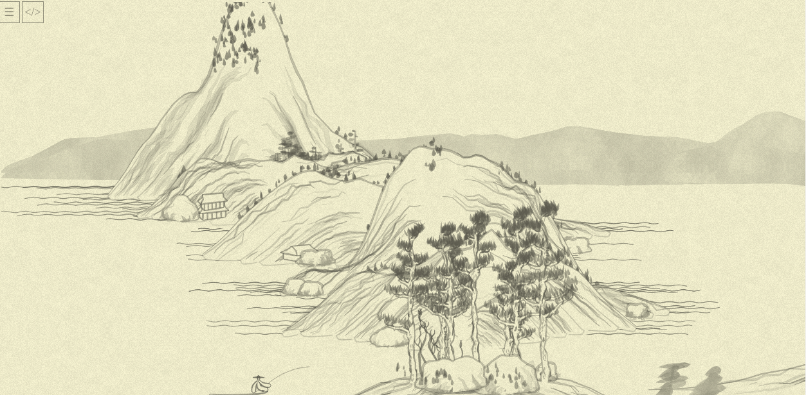
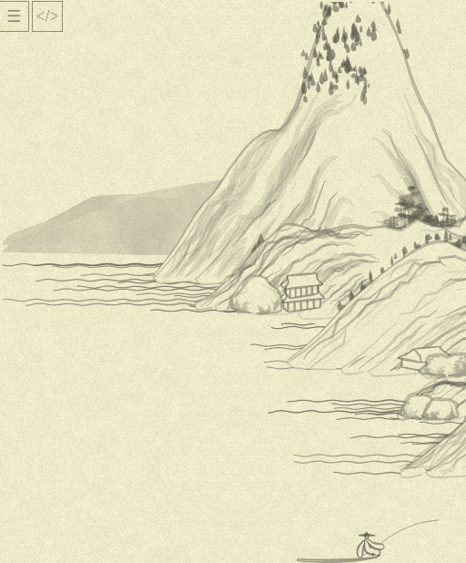
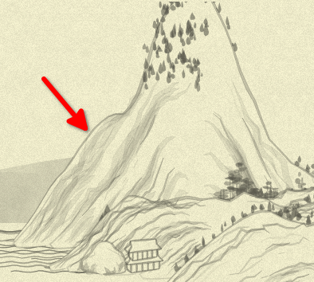
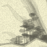
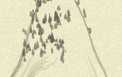
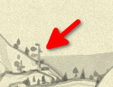
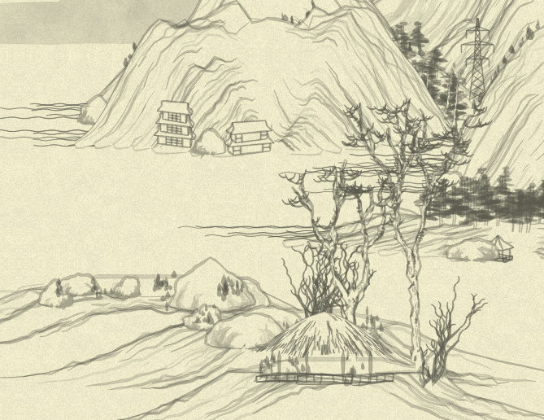

# Day 24: Putting it all together

On [day 1](day1.md), I stated two goals for this advent-of-grokking:

1. To _develop intuitions_ on how the procedural art generation works, which I knew almost nothing about before the project start
2. To _test intuitions_ about my approach to mostly-declarative code via carefully chosen language atoms and chaining of computations

I am reasonably happy in both regards: the approximate understanding of _how it all done_ did emerged of this project—and that's what the rest of today's text would be dedicated to. As for the second goal, I indeed _tested_ my approaches, and found them working, even if not as impressively as I initially hoped. I half-expected I'll be able to distill every step of the algorithm (planning the landscape→filling the mountain→drawing the tree or house or boat) to exactly one fully declarative statement—but understood it is an overestimation of potential expressiveness. Still, the approach was battle-tested on the area foreign to me, and I have things to think about.

Following is my attempt to explain what I understood through the previous 23 days, spending roughly 40 to 90 mins per day for code reading, rewriting, and explaining in this diary.

## How the `{Shan, Shui}*` works

Here is the beginning of the infinite scroll I've investigated.



It is rendered by the file `grok.html`. This file contains my rewrite of _some_ of the original code's functions; this rewrite is selective, but spans all layers from entire landscape to single lines. The picture generated is exactly the same as the original code generates, with two difference: First, instead of random picture every time, I fixed the pseudo-random generator seed to a constant, so the elements of the picture are still guided by random numbers, but it is the same sequence of numbers, and thus, the same picture every time. Second, at the latest stage I changed zoom of the picture a bit, so more o it will be visible.

The picture is generated in 512px-wide frames, here is the first one:



The drawing of one frame is performed in [`chunkloader`](https://github.com/zverok/grok-shan-shui/blob/main/grok.html#L3922) function, which adds several "chunks" of the canvas to the global `STATE.chunks`. _Function investigation: [day 12](day12.md), [day 21](day21.md)._

What chunks should be in the frame, is decided by [`mountplanner`](https://github.com/zverok/grok-shan-shui/blob/main/grok.html#L3798) function. It returns a list of objects with fields `{tag, x, y}`, and this objects are then drawn in `chunkloader` by calling appropriate functions depending on `tag`. _Function investigation: [day 13](day13.md), [day 14](day14.md)._

`mountplanner`, as well as many other functions down the layers, uses [Perlin noise](https://en.wikipedia.org/wiki/Perlin_noise) generator. This is the algorithm to produce "gradient noise": sequence of random values such that nearby values would change smoothly:
```js
// take a range of values from 1 to 3 with step 0.2, and produce noise for them:
range(1, 3, 0.2).map(x => Noise.noise(x).toFixed(2)).join(', ')
// '0.69, 0.66, 0.59, 0.58, 0.54, 0.43, 0.44, 0.44, 0.42, 0.39'
```

> Just when I started to work on this project, I stumbled upon an article about producing another kind of generative art: [Replicating Minecraft World Generation in Python by
Bilal Himite](https://towardsdatascience.com/replicating-minecraft-world-generation-in-python-1b491bc9b9a4). It explains Perlin noise and its usage for procedural generation much better than I've could.

`mountplanner` can generate these chunk tags:

* **`"mountain"`**: most prominent shape of the picture: distinctive mountain with small trees and houses; it is attempted to be added every 30 pixels, **if** this point is local maximum of the Perlin noise;
* **`"distmount"`**: the gray one in the far background, added every 1000 pixels;
* **`"flatmount"`**: indeed a flat one (more like an island) in the foreground, with rocks and complex trees, added with random chance 0.1
* **`"boat"`**: well... a boat! added with a chance 0.2.

The algorithm of planning is adjusted by:
* local `registry` of "points where mountain center were added" (so no two mountains would have _exactly_ the same center by `x`)
* global `STATE.occupiedXs` that ensures that `flatmount`'s center is never planned at `x` under the existing `mountain`... (but then, this `x` is adjusted by randomness, so, it is complicated!)

When the `chunkloader` receives list of tags, it draws them with appropriate functions. For example, `mountain` tag corresponds to `Mount.mountain` (also, in this case, `water` is invoked, so each tall mid-plan mountain has a water attached to it).

[`Mount.mountain`](https://github.com/zverok/grok-shan-shui/blob/main/grok.html#L1890) _(days [15](day15.md), [16](day16.md), [17](day17.md), [18](day18.md), [19](day19.md), [20](day20.md))_ first, generates several _layers_: several arcs inside each other, adjusted by noise to not look artificial:



Outer layer then used to fill the mountain with color and draw outline, and the rest of them—to produce a texture of the mountain. Then, internal function `generate` called many times to add smaller objects to the mountain. `generate` receives function parameters: how to choose at which point to draw, and, when chosen, how to draw. E.g., the `generate` call like this:

```js
generate(
  (x, y) => Mount.rock(x + x_offset, y + y_offset, seed, {wid: rand(20, 40), hei: rand(20, 40), sha: 2}),
  {if: (_, pointIdx) => (pointIdx == 0 || pointIdx == resolution.num_points - 1) && chance(0.1)},
);
```
...codes the statement roughly saying "draw a rock at the point `(x, y)`, if it is at the end of the arc (`pointIdx` is index of currently checked point in the list of layer's points, e.g. the condition is only `true` for the first and last points: ends of the arc), and with probability 0.1."

In general, each kind of objects has their own hand-crafted conditions to "randomly" appear, and their own range of randomness in attributes (like width, height, number of stories in the building, or its rotation), producing surprisingly pleasant and naturally-looking randomness.

There are several objects that can be drawn on a `mountain`:
* various kinds of small trees: `Tree.tree01` to `Tree.tree03`;
* various kinds of buildings: `Arch.arch01` to `Arch.arch04`, and, somewhat Easter-egg-y, `Arch.transmissionTower01`;
* finally, `Mount.rock`.

For example, each [`tree01`](https://github.com/zverok/grok-shan-shui/blob/main/grok.html#L912) _(days [2](day02.md), [3](day03.md), [4](day04.md), [5](day05.md))_



...is created by producing two lists of 10 points each, making two parallel lines, slightly adjusted by noise, and drawing several "blobs" (ellipses, but adjusted by random noise) around the top 6 of them, reducing in size towards the top of the tree.

[`tree02`](https://github.com/zverok/grok-shan-shui/blob/main/grok.html#L944) _([day 5](day05.md))_



...is just a set of blobs, with no trunk; and [`tree03`](https://github.com/zverok/grok-shan-shui/blob/main/grok.html#L961) _([day 6](day06.md))_



...is made of one filled polygon of two trunk lines, and, again, some blobs—but smaller than for tree01 and shifted aside from the trunk.

Looking at something different, this is [`arch02`](https://github.com/zverok/grok-shan-shui/blob/main/grok.html#L3146) _(days [7](day07.md) and [11](day11.md), with days inbetween spent for its various elements)_:


It is produced by `box_` function for walls of each of two stories, and `roof` for their, well, roofs.

The [`box_`](https://github.com/zverok/grok-shan-shui/blob/main/grok.html#L2630) function (days [7](day07.md), [8](day08.md), [9](day09.md), [10](day10.md)) just calculates lines of the parallelepiped of the house, considering desired size, rotation, perspective, and transparency. The lines (initially represented by two points) are then "extrapolated" into many mid-points with [`extrapolate`](https://github.com/zverok/grok-shan-shui/blob/main/grok.html#L766) (called `div` in the original code, days [8](day08.md) and [9](day09.md)); then the line is drawn with the `stroke_`, imitatating the brush-stroke. The [`stroke_`](https://github.com/zverok/grok-shan-shui/blob/main/grok.html#L608) _(day [10](day10.md))_ does this by just calculating two lines that are shifted _a bit_ (by a noise, again) up and down from the points of the box line, and making a thin filled polygon of them, producing the effect of a slightly uneven brash. Finally, the box uses a [`decorator`](https://github.com/zverok/grok-shan-shui/blob/main/grok.html#L2777) function _(day [10](day10.md))_ for wall ornaments, which just calculates a few more line inside the wall specified, and draws them again with a `stroke_`.

This is the end of what I've seen closely. Much more is left outside of the investigation—other architectural forms, larger (foreground) trees, people, boats, etc. But now I _feel_ that it can be guessed/extrapolated from what we already know.

Simplifying, we might say that the main tools of the creation here are:

* simple geometry primitives—lines, ellipses, parallelepipeds (do you love the word already?), arcs—and imagining how "Chinese-painting-looking" elements like trees and pagodas can be described with them;
* randomness in general and Perlin noise in particular, making it all looking hand-drawn;
* probably, a lot of hand-picking and experimenting with ranges of randomness, orders of elements, probabilities, and combinations—to make the picture visually rich each time.

Just for reference, here is another side of the "debug picture", where we can see several other features:



...but I urge you to go and play with the [online example](http://shan-shui-inf.lingdong.works/), and adore its variability, made of—as we now know—not that large a number of elements.

> Despite the fact that digging into "how it all done" leads to many of _ah, it is that simple!_ moments, my fascination with **[Lingdong Huang](https://github.com/LingDong-)**, the original author's, talent, grew only stronger. This way of seeing things and ability to deconstruct artistic imagination into simple math facts—and construct it back into the picture—I can only adore and envy.

PS: I've cheated a bit with timing: this huge last post took a few hours on days 24 and 25. Other than that, the timeboxed experiment worked for me well, and, I hope, was fun to follow!
